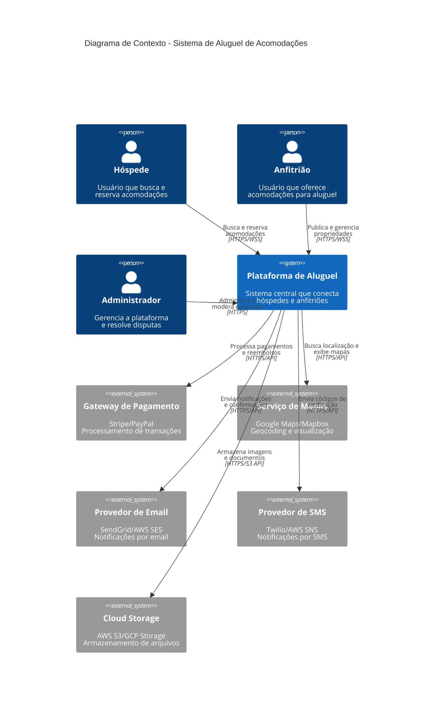
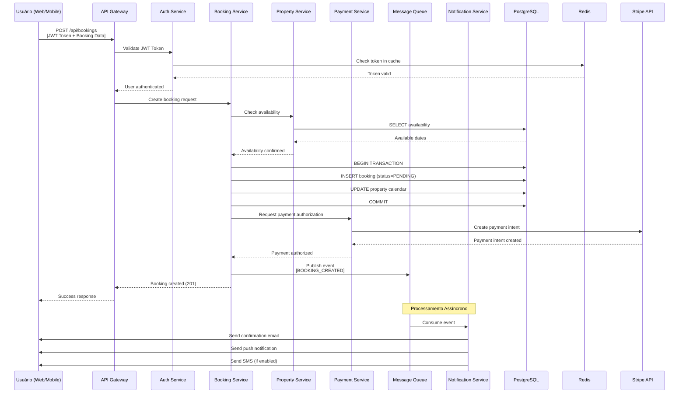

# Arquitetura de Sistema de Aluguel de Acomodações

## Diagrama de Arquitetura em Camadas

```mermaid
graph TB
    subgraph "CAMADA DE APRESENTAÇÃO"
        WEB[Web App - React/Next.js<br/>SPA + SSR]
        MOBILE[Mobile App - React Native<br/>iOS + Android]
        ADMIN[Admin Panel - React<br/>Dashboard Interno]
    end

    subgraph "CAMADA DE GATEWAY & LOAD BALANCING"
        LB[Load Balancer<br/>Nginx/AWS ALB]
        APIGW[API Gateway<br/>Kong/AWS API Gateway<br/>Rate Limiting + Auth]
        WS[WebSocket Server<br/>Socket.io/AWS AppSync<br/>Chat em Tempo Real]
    end

    subgraph "CAMADA DE APLICAÇÃO - MICROSERVIÇOS"
        subgraph "Core Services"
            AUTH[Auth Service<br/>JWT + OAuth2<br/>Node.js/Express]
            USER[User Service<br/>Perfis e Verificação<br/>Node.js/Express]
            PROPERTY[Property Service<br/>Acomodações CRUD<br/>Node.js/Express]
            SEARCH[Search Service<br/>Busca e Filtros<br/>Node.js + Elasticsearch]
            BOOKING[Booking Service<br/>Reservas e Disponibilidade<br/>Node.js/Express]
            PAYMENT[Payment Service<br/>Transações<br/>Node.js/Express]
            REVIEW[Review Service<br/>Avaliações<br/>Node.js/Express]
            MESSAGE[Messaging Service<br/>Chat P2P<br/>Node.js/Express]
        end

        subgraph "Support Services"
            NOTIF[Notification Service<br/>Email/SMS/Push<br/>Node.js + Bull]
            UPLOAD[Upload Service<br/>Processamento de Imagens<br/>Node.js + Sharp]
            ANALYTICS[Analytics Service<br/>Métricas e Reports<br/>Python/Node.js]
            FRAUD[Fraud Detection<br/>ML Anti-fraude<br/>Python + Scikit]
        end

        subgraph "Admin Services"
            MODERATION[Moderation Service<br/>Aprovação de Conteúdo<br/>Node.js/Express]
            ADMIN_API[Admin API<br/>Gestão da Plataforma<br/>Node.js/Express]
        end
    end

    subgraph "CAMADA DE DADOS"
        subgraph "Databases"
            PG_USER[(PostgreSQL<br/>Users + Auth)]
            PG_PROP[(PostgreSQL<br/>Properties)]
            PG_BOOK[(PostgreSQL<br/>Bookings)]
            PG_PAY[(PostgreSQL<br/>Payments)]
            MONGO[(MongoDB<br/>Messages + Logs)]
        end

        subgraph "Cache & Search"
            REDIS[(Redis<br/>Session + Cache)]
            ELASTIC[(Elasticsearch<br/>Search Index)]
        end

        subgraph "Storage"
            S3[(Object Storage<br/>S3/MinIO<br/>Imagens e Docs)]
        end

        subgraph "Message Queue"
            QUEUE[Message Broker<br/>RabbitMQ/AWS SQS<br/>Processamento Assíncrono]
        end
    end

    subgraph "SERVIÇOS EXTERNOS"
        STRIPE[Payment Gateway<br/>Stripe/PayPal<br/>Processamento de Pagamentos]
        MAPS[Maps API<br/>Google Maps/Mapbox<br/>Geocoding + Visualização]
        EMAIL[Email Provider<br/>SendGrid/AWS SES<br/>Transactional Emails]
        SMS[SMS Provider<br/>Twilio/AWS SNS<br/>Notificações SMS]
        CDN[CDN<br/>CloudFront/Cloudflare<br/>Assets Estáticos]
        STORAGE_EXT[Cloud Storage<br/>AWS S3/GCP Storage<br/>Backup e Archive]
    end

    subgraph "MONITORAMENTO E SEGURANÇA"
        MONITOR[Monitoring<br/>Prometheus + Grafana]
        LOGS[Centralized Logging<br/>ELK Stack/CloudWatch]
        TRACE[Distributed Tracing<br/>Jaeger/AWS X-Ray]
    end

    %% Conexões Frontend -> Gateway
    WEB -->|HTTPS/REST| LB
    MOBILE -->|HTTPS/REST| LB
    ADMIN -->|HTTPS/REST| LB
    WEB -.->|WSS| WS
    MOBILE -.->|WSS| WS

    %% Gateway -> Backend
    LB --> APIGW
    APIGW -->|REST| AUTH
    APIGW -->|REST| USER
    APIGW -->|REST| PROPERTY
    APIGW -->|REST| SEARCH
    APIGW -->|REST| BOOKING
    APIGW -->|REST| PAYMENT
    APIGW -->|REST| REVIEW
    APIGW -->|REST| MESSAGE
    APIGW -->|REST| ADMIN_API

    WS -.->|WebSocket| MESSAGE

    %% Interações entre Microserviços
    BOOKING -->|REST| PROPERTY
    BOOKING -->|Event| QUEUE
    PAYMENT -->|REST| BOOKING
    REVIEW -->|REST| BOOKING
    REVIEW -->|REST| PROPERTY
    MESSAGE -->|REST| USER
    UPLOAD -->|Process| QUEUE
    NOTIF -->|Consume| QUEUE
    FRAUD -->|REST| PAYMENT
    FRAUD -->|REST| BOOKING
    MODERATION -->|REST| PROPERTY
    MODERATION -->|REST| REVIEW

    %% Backend -> Databases
    AUTH --> PG_USER
    USER --> PG_USER
    PROPERTY --> PG_PROP
    BOOKING --> PG_BOOK
    PAYMENT --> PG_PAY
    MESSAGE --> MONGO
    ANALYTICS --> MONGO

    %% Backend -> Cache & Search
    AUTH --> REDIS
    USER --> REDIS
    PROPERTY --> REDIS
    SEARCH --> ELASTIC
    PROPERTY -.->|Index| ELASTIC

    %% Backend -> Storage
    UPLOAD --> S3
    PROPERTY --> S3
    USER --> S3

    %% Backend -> Queue
    BOOKING -.->|Publish| QUEUE
    PAYMENT -.->|Publish| QUEUE
    NOTIF -.->|Subscribe| QUEUE
    ANALYTICS -.->|Subscribe| QUEUE

    %% Backend -> Serviços Externos
    PAYMENT -->|API| STRIPE
    PROPERTY -->|API| MAPS
    SEARCH -->|API| MAPS
    NOTIF -->|API| EMAIL
    NOTIF -->|API| SMS
    UPLOAD -->|Upload| STORAGE_EXT

    %% CDN
    CDN -->|Cache| S3
    WEB -.->|Static Assets| CDN
    MOBILE -.->|Static Assets| CDN

    %% Monitoramento
    APIGW -.->|Metrics| MONITOR
    AUTH -.->|Metrics| MONITOR
    BOOKING -.->|Metrics| MONITOR
    PAYMENT -.->|Metrics| MONITOR
    APIGW -.->|Logs| LOGS
    AUTH -.->|Logs| LOGS
    BOOKING -.->|Trace| TRACE

    %% Estilos
    classDef frontend fill:#e1f5ff,stroke:#01579b,stroke-width:2px
    classDef gateway fill:#fff9c4,stroke:#f57f17,stroke-width:2px
    classDef service fill:#c8e6c9,stroke:#2e7d32,stroke-width:2px
    classDef database fill:#ffccbc,stroke:#bf360c,stroke-width:2px
    classDef external fill:#f3e5f5,stroke:#4a148c,stroke-width:2px
    classDef monitor fill:#e0e0e0,stroke:#424242,stroke-width:2px

    class WEB,MOBILE,ADMIN frontend
    class LB,APIGW,WS gateway
    class AUTH,USER,PROPERTY,SEARCH,BOOKING,PAYMENT,REVIEW,MESSAGE,NOTIF,UPLOAD,ANALYTICS,FRAUD,MODERATION,ADMIN_API service
    class PG_USER,PG_PROP,PG_BOOK,PG_PAY,MONGO,REDIS,ELASTIC,S3,QUEUE database
    class STRIPE,MAPS,EMAIL,SMS,CDN,STORAGE_EXT external
    class MONITOR,LOGS,TRACE monitor
```



---

## Diagrama C4 - Nível de Contexto



---

## Diagrama C4 - Nível de Container

```mermaid
C4Container
    title Diagrama de Container - Arquitetura Interna da Plataforma

    Person(user, "Usuário", "Hóspede, Anfitrião ou Admin")

    Container_Boundary(frontend, "Camada de Apresentação") {
        Container(webapp, "Web Application", "React/Next.js", "SPA com SSR para SEO")
        Container(mobile, "Mobile App", "React Native", "App nativo iOS/Android")
        Container(admin_panel, "Admin Panel", "React", "Dashboard administrativo")
    }

    Container_Boundary(gateway, "Gateway Layer") {
        Container(api_gateway, "API Gateway", "Kong/AWS API Gateway", "Roteamento, autenticação,<br/>rate limiting")
        Container(ws_server, "WebSocket Server", "Socket.io", "Comunicação em tempo real")
    }

    Container_Boundary(backend, "Camada de Aplicação") {
        Container(auth_svc, "Auth Service", "Node.js/Express", "Autenticação e autorização")
        Container(booking_svc, "Booking Service", "Node.js/Express", "Gestão de reservas")
        Container(payment_svc, "Payment Service", "Node.js/Express", "Processamento de pagamentos")
        Container(search_svc, "Search Service", "Node.js + Elasticsearch", "Busca e filtros avançados")
        Container(notification_svc, "Notification Service", "Node.js + Bull", "Envio de notificações")
    }

    Container_Boundary(data, "Camada de Dados") {
        ContainerDb(postgres, "PostgreSQL", "Relational DB", "Dados transacionais")
        ContainerDb(redis, "Redis", "Cache", "Sessões e cache")
        ContainerDb(elasticsearch, "Elasticsearch", "Search Engine", "Índice de busca")
        ContainerDb(s3, "S3/MinIO", "Object Storage", "Imagens e documentos")
        ContainerQueue(queue, "RabbitMQ", "Message Broker", "Processamento assíncrono")
    }

    System_Ext(stripe, "Stripe", "Payment Gateway")
    System_Ext(maps_api, "Google Maps", "Maps API")

    Rel(user, webapp, "Usa", "HTTPS")
    Rel(user, mobile, "Usa", "HTTPS")
    Rel(user, admin_panel, "Usa", "HTTPS")

    Rel(webapp, api_gateway, "Faz requisições", "REST/HTTPS")
    Rel(mobile, api_gateway, "Faz requisições", "REST/HTTPS")
    Rel(webapp, ws_server, "Conecta para chat", "WSS")
    Rel(mobile, ws_server, "Conecta para chat", "WSS")

    Rel(api_gateway, auth_svc, "Autentica", "REST")
    Rel(api_gateway, booking_svc, "Gerencia reservas", "REST")
    Rel(api_gateway, payment_svc, "Processa pagamentos", "REST")
    Rel(api_gateway, search_svc, "Busca propriedades", "REST")

    Rel(booking_svc, queue, "Publica eventos", "AMQP")
    Rel(notification_svc, queue, "Consome eventos", "AMQP")

    Rel(auth_svc, postgres, "Lê/Escreve", "SQL")
    Rel(booking_svc, postgres, "Lê/Escreve", "SQL")
    Rel(payment_svc, postgres, "Lê/Escreve", "SQL")
    Rel(auth_svc, redis, "Cache sessões", "Redis Protocol")
    Rel(search_svc, elasticsearch, "Busca", "HTTP/JSON")
    Rel(booking_svc, s3, "Armazena docs", "S3 API")

    Rel(payment_svc, stripe, "Processa pagamento", "HTTPS/API")
    Rel(search_svc, maps_api, "Geocoding", "HTTPS/API")

    UpdateLayoutConfig($c4ShapeInRow="3", $c4BoundaryInRow="1")
```



---

## Fluxo de Dados - Criação de Reserva (Sequence Diagram)



---

## Decisões Arquiteturais e Justificativas

### 1. **Arquitetura de Microserviços**

**Decisão:** Adotar microserviços em vez de monolito

**Justificativas:**
- ✅ **Escalabilidade independente**: Search e Booking podem escalar diferentemente
- ✅ **Desenvolvimento paralelo**: Times diferentes em serviços diferentes
- ✅ **Isolamento de falhas**: Falha no Payment não derruba Messaging
- ✅ **Tecnologias especializadas**: Elasticsearch para busca, Node.js para API
- ⚠️ **Complexidade operacional**: Requer DevOps maduro e monitoramento robusto

---

### 2. **API Gateway (Kong/AWS API Gateway)**

**Decisão:** Centralizar ponto de entrada via API Gateway

**Justificativas:**
- ✅ **Rate limiting**: Proteção contra abuso e DDoS
- ✅ **Autenticação centralizada**: JWT validation em um ponto
- ✅ **Roteamento inteligente**: Circuit breaker e retry logic
- ✅ **Versionamento de API**: Suporte a múltiplas versões simultaneamente
- ✅ **Observabilidade**: Métricas centralizadas de todas as requisições

---

### 3. **PostgreSQL para Dados Transacionais**

**Decisão:** PostgreSQL como banco principal, particionado por domínio

**Justificativas:**
- ✅ **ACID compliance**: Crítico para reservas e pagamentos
- ✅ **Relações complexas**: Users ↔ Properties ↔ Bookings
- ✅ **Suporte a JSON**: Flexibilidade para dados semi-estruturados
- ✅ **Maturidade**: Comunidade grande, ferramentas robustas
- 🔄 **Alternativa considerada**: MySQL (similar), MongoDB (rejeitado por falta de transações complexas)

**Estratégia de Particionamento:**
- Database por bounded context (Users DB, Bookings DB, Payments DB)
- Evita joins cross-service
- Cada serviço possui seu schema independente

---

### 4. **Elasticsearch para Busca**

**Decisão:** Elasticsearch dedicado para search e filtros

**Justificativas:**
- ✅ **Full-text search**: Busca por texto livre em descrições
- ✅ **Geolocation**: Busca por proximidade geográfica
- ✅ **Faceted search**: Filtros múltiplos simultâneos (preço, comodidades, avaliação)
- ✅ **Performance**: Queries complexas em < 100ms
- ✅ **Escalabilidade horizontal**: Sharding automático

**Sincronização:**
- Change Data Capture (CDC) via Debezium
- Ou event-driven: Property Service publica eventos → indexador consome

---

### 5. **Redis para Cache e Sessões**

**Decisão:** Redis como cache distribuído e session store

**Justificativas:**
- ✅ **Performance**: Sub-millisecond latency
- ✅ **Sessões JWT**: Blacklist de tokens revogados
- ✅ **Cache de queries**: Resultados de busca frequentes
- ✅ **Rate limiting**: Contador de requests por usuário
- ✅ **Pub/Sub**: Notificações em tempo real (alternativa ao WebSocket para alguns casos)

**Estratégia de Cache:**
- Cache-aside pattern para dados de leitura frequente
- TTL configurável por tipo de dado (sessões: 24h, busca: 15min)

---

### 6. **Message Queue (RabbitMQ/SQS)**

**Decisão:** Processamento assíncrono via filas

**Justificativas:**
- ✅ **Desacoplamento**: Booking não espera email ser enviado
- ✅ **Resiliência**: Retry automático em caso de falha
- ✅ **Picos de carga**: Absorve spikes sem sobrecarregar serviços downstream
- ✅ **Event-driven**: Arquitetura baseada em eventos (CQRS leve)

**Eventos Principais:**
- `BOOKING_CREATED`, `BOOKING_CONFIRMED`, `BOOKING_CANCELLED`
- `PAYMENT_PROCESSED`, `PAYMENT_FAILED`
- `REVIEW_SUBMITTED`, `MESSAGE_SENT`

**Consumidores:**
- Notification Service (emails, SMS, push)
- Analytics Service (métricas em tempo real)
- Fraud Detection (análise assíncrona)

---

### 7. **WebSocket para Chat em Tempo Real**

**Decisão:** WebSocket server dedicado para mensagens

**Justificativas:**
- ✅ **Latência baixa**: Mensagens instantâneas
- ✅ **Bi-direcional**: Server pode push notificações
- ✅ **Indicadores de presença**: "usuário está digitando..."
- 🔄 **Alternativa**: Polling (ineficiente), Server-Sent Events (unidirecional)

**Implementação:**
- Socket.io para fallback automático (WebSocket → polling)
- Sticky sessions no load balancer
- Redis Pub/Sub para sincronizar múltiplas instâncias do WS server

---

### 8. **CDN (CloudFront/Cloudflare)**

**Decisão:** CDN global para assets estáticos e imagens

**Justificativas:**
- ✅ **Performance**: Edge locations próximas ao usuário (< 50ms)
- ✅ **Redução de banda**: Origin server economiza tráfego
- ✅ **Proteção DDoS**: CDN absorve ataques
- ✅ **Image optimization**: Resize automático, formato WebP/AVIF

**Estratégia de Cache:**
- Imagens de propriedades: 1 ano (com versioning)
- Assets estáticos (JS/CSS): Cache agressivo com hash no nome
- HTML: Cache curto ou sem cache (para SEO dinâmico)

---

### 9. **Monitoramento e Observabilidade**

**Decisão:** Stack completo de observabilidade (Metrics + Logs + Traces)

**Componentes:**
- **Prometheus + Grafana**: Métricas de sistema e aplicação
- **ELK Stack**: Logs centralizados e pesquisáveis
- **Jaeger**: Distributed tracing para debug de latência

**Justificativas:**
- ✅ **Debugging**: Rastrear requests cross-service
- ✅ **Alertas**: Notificação proativa de problemas
- ✅ **Capacity planning**: Métricas para decisões de escala
- ✅ **SLA monitoring**: Garantir uptime de 99.9%

**Métricas Chave:**
- Latência P50, P95, P99 por endpoint
- Taxa de erro (4xx, 5xx)
- Throughput (requests/segundo)
- Database connection pool utilization
- Queue depth

---

### 10. **Estratégia de Deploy e Escala**

**Decisão:** Containerização (Docker) + Orquestração (Kubernetes)

**Justificativas:**
- ✅ **Portabilidade**: Mesma imagem em dev, staging, prod
- ✅ **Auto-scaling**: HPA baseado em CPU/memória/custom metrics
- ✅ **Rolling updates**: Zero-downtime deploys
- ✅ **Self-healing**: Pods reiniciam automaticamente em falha

**Estratégia de Escala:**
```yaml
Search Service: 10-50 pods (alta variação de carga)
Booking Service: 5-20 pods (crítico, sempre disponível)
Auth Service: 3-10 pods (cache-heavy, escala moderada)
Notification Service: 2-10 pods (queue-based, escala conforme fila)
```

---

## Padrões de Comunicação

### Síncrono (REST)
```
Frontend → API Gateway → Microserviço → Database
Tempo real necessário (busca, login, criação de reserva)
```

### Assíncrono (Event-Driven)
```
Booking Service → Queue → Notification Service → Email Provider
Processamento pode ser diferido (emails, analytics, ML)
```

### Híbrido (WebSocket)
```
Frontend ←→ WebSocket Server ←→ Message Service ←→ Redis Pub/Sub
Baixa latência necessária (chat, notificações em tempo real)
```

---

## Considerações de Segurança

1. **Autenticação**: JWT com refresh tokens, expiração curta (15min)
2. **Autorização**: RBAC implementado no API Gateway + cada serviço
3. **Comunicação**: TLS 1.3 obrigatório, mTLS entre serviços internos (service mesh)
4. **Dados sensíveis**: Criptografia at-rest (PG, S3), PCI-DSS para dados de cartão
5. **Rate limiting**: Por IP, por usuário, por endpoint
6. **DDoS protection**: Cloudflare + WAF
7. **Secrets management**: Vault/AWS Secrets Manager (nunca em código)

---

## Estimativa de Capacidade (Exemplo)

**Cenário:** 100k usuários ativos mensais, 10k reservas/dia

| Componente | Especificação | Justificativa |
|------------|---------------|---------------|
| **API Gateway** | 4 instâncias (4 vCPU, 8GB RAM) | ~5000 req/s |
| **Booking Service** | 10 pods (2 vCPU, 4GB RAM) | Serviço crítico, alta disponibilidade |
| **PostgreSQL** | Primary + 2 réplicas leitura (16 vCPU, 64GB RAM) | 50k conexões simultâneas |
| **Redis** | Cluster 3 nós (8GB RAM cada) | 1M keys, 10k ops/s |
| **Elasticsearch** | 5 nós (8 vCPU, 32GB RAM) | 100M documentos, 1000 queries/s |
| **RabbitMQ** | 3 nós cluster (4 vCPU, 8GB RAM) | 10k msgs/s |

---

Esta arquitetura balanceia **escalabilidade**, **resiliência**, **manutenibilidade** e **custo**, sendo adequada para um marketplace de médio a grande porte com potencial de crescimento significativo.