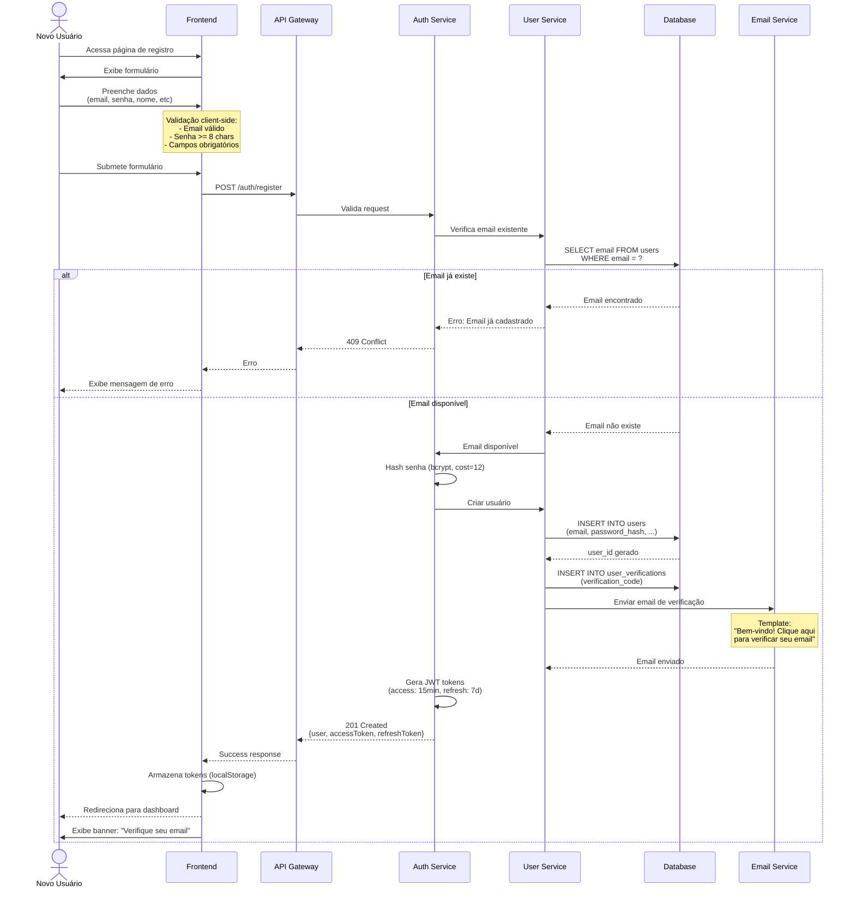
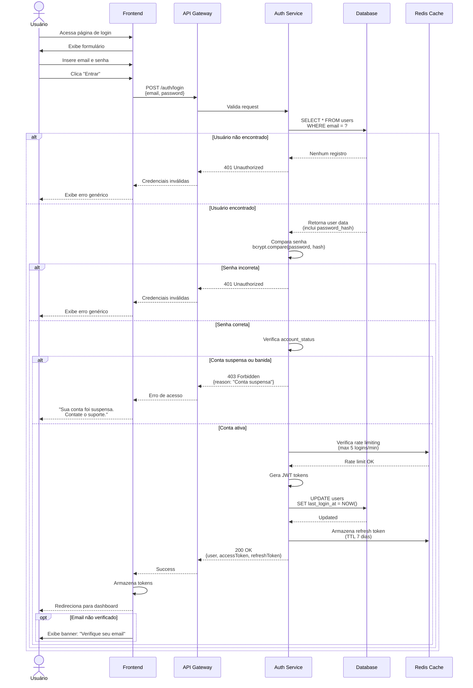
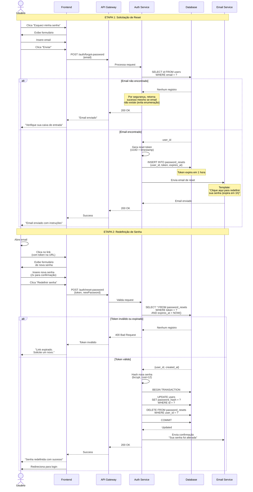
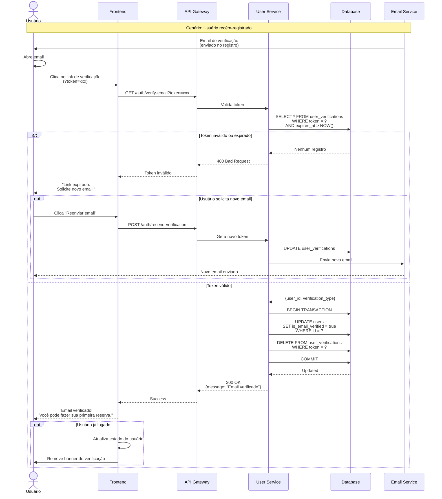
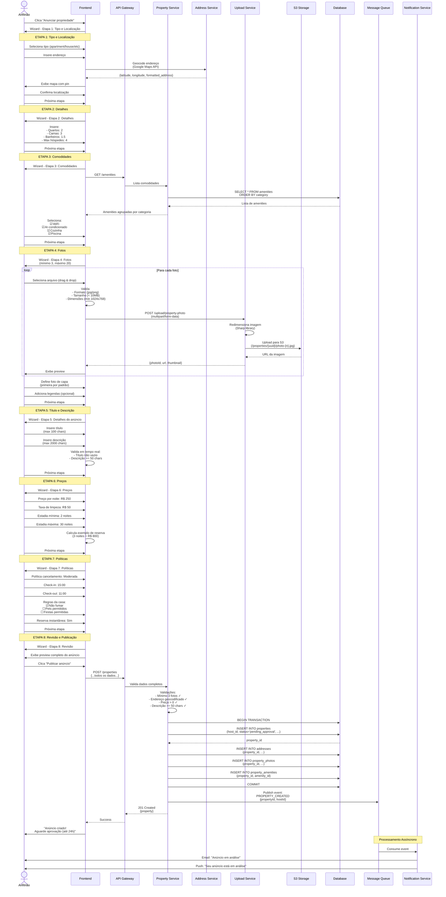
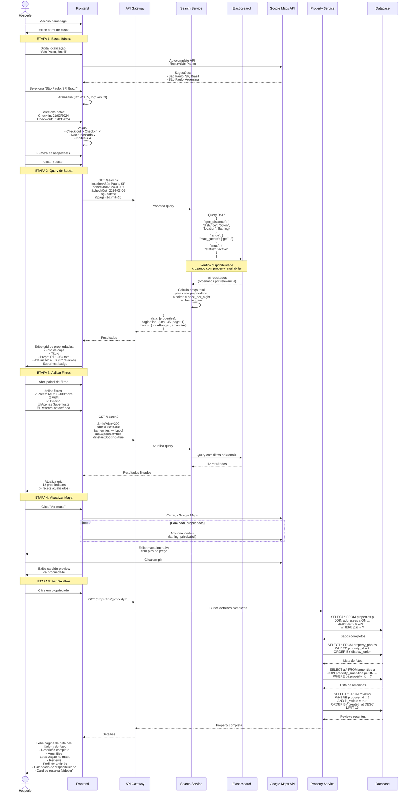
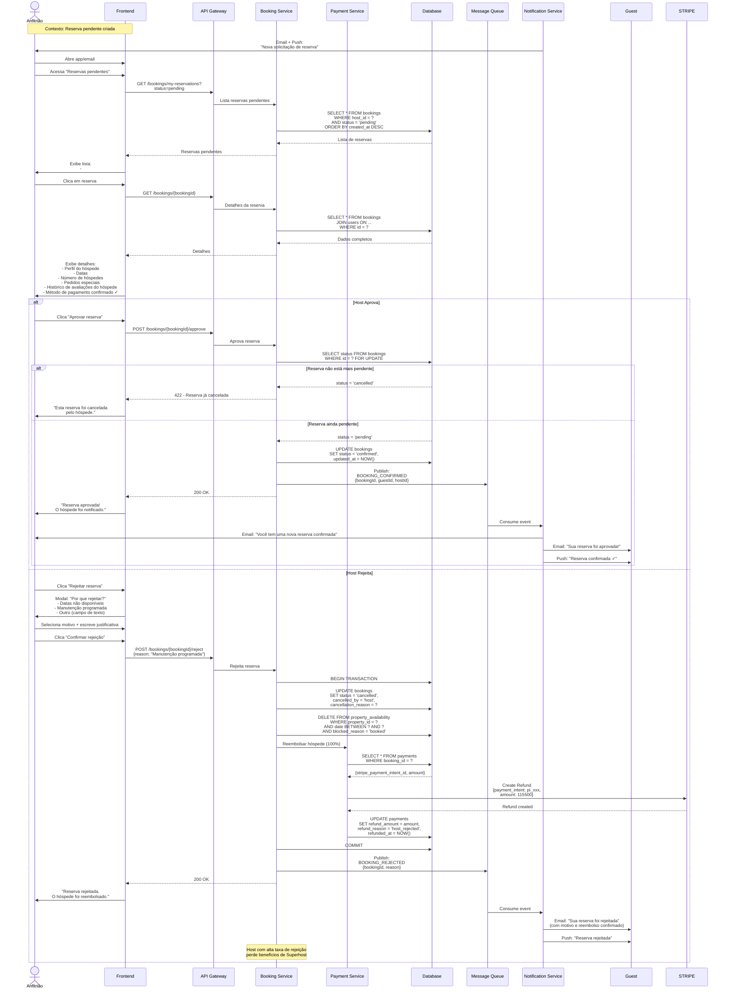
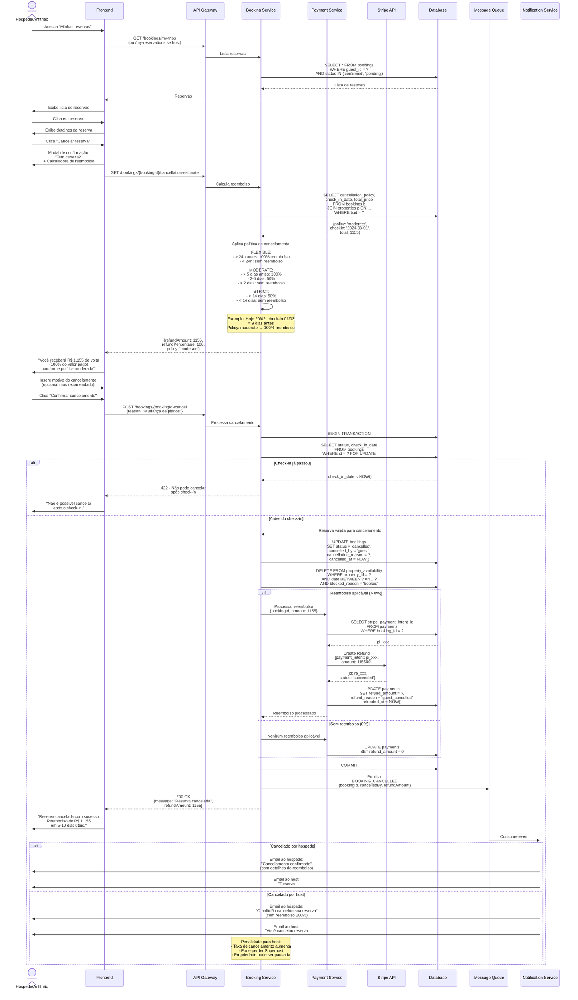
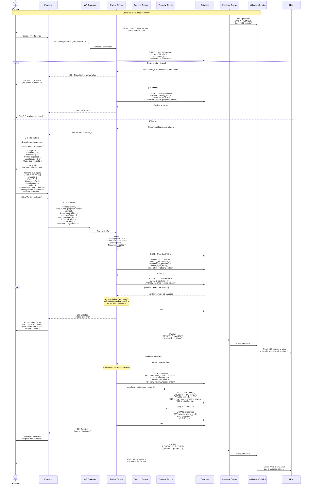

# Documentação de Fluxos de Usuário - Sistema de Aluguel de Acomodações

---

## F1 - CADASTRO E AUTENTICAÇÃO

### F1.1 - Registro de Novo Usuário

#### Descrição Detalhada

O fluxo de registro permite que novos usuários criem uma conta na plataforma, seja como hóspede ou anfitrião. O processo inclui validação de dados, verificação de email e criação de perfil.

**Etapas:**
1. Usuário acessa página de registro
2. Preenche formulário com dados pessoais (email, senha, nome, telefone, data de nascimento)
3. Seleciona papel inicial (guest ou host)
4. Sistema valida dados em tempo real (formato de email, força da senha)
5. Usuário submete formulário
6. Sistema verifica se email já existe
7. Sistema cria hash da senha (bcrypt)
8. Sistema cria conta com status "não verificado"
9. Sistema envia email de verificação
10. Sistema gera tokens JWT (access + refresh)
11. Sistema retorna dados do usuário e tokens
12. Frontend redireciona para dashboard

**Atores:**
- **Usuário** (novo visitante)
- **Frontend** (Web/Mobile App)
- **API Gateway**
- **Auth Service**
- **User Service**
- **Database** (PostgreSQL)
- **Email Service** (SendGrid/AWS SES)

#### Diagrama de Sequência

#### Regras de Negócio - Registro

| ID | Regra | Tipo | Severidade |
|----|-------|------|------------|
| RN-REG-01 | Email deve ser único na plataforma | Validação | Crítica |
| RN-REG-02 | Senha mínima: 8 caracteres, 1 maiúscula, 1 número, 1 especial | Validação | Crítica |
| RN-REG-03 | Usuário deve ter no mínimo 18 anos (date_of_birth) | Validação | Crítica |
| RN-REG-04 | Email deve seguir formato RFC 5322 | Validação | Crítica |
| RN-REG-05 | Telefone deve incluir código do país (+55...) | Validação | Média |
| RN-REG-06 | Conta criada com status `active` mas `is_email_verified = false` | Negócio | Alta |
| RN-REG-07 | Email de verificação expira em 24 horas | Negócio | Alta |
| RN-REG-08 | Access token expira em 15 minutos | Segurança | Crítica |
| RN-REG-09 | Refresh token expira em 7 dias | Segurança | Crítica |
| RN-REG-10 | Hash de senha usa bcrypt com cost factor 12 | Segurança | Crítica |

---

### F1.2 - Login

#### Descrição Detalhada

Processo de autenticação de usuários existentes.

**Etapas:**
1. Usuário acessa página de login
2. Insere email e senha
3. Sistema valida credenciais
4. Sistema verifica status da conta (ativa, suspensa, banida)
5. Sistema gera novos tokens JWT
6. Sistema registra timestamp de último login
7. Sistema retorna dados do usuário e tokens

#### Diagrama de Sequência

#### Regras de Negócio - Login

| ID | Regra | Tipo | Severidade |
|----|-------|------|------------|
| RN-LOG-01 | Mensagem de erro genérica para email/senha inválidos (evitar enumeração) | Segurança | Crítica |
| RN-LOG-02 | Rate limiting: máximo 5 tentativas por minuto por IP | Segurança | Crítica |
| RN-LOG-03 | Bloqueio temporário após 5 tentativas falhas (lockout 15 min) | Segurança | Alta |
| RN-LOG-04 | Contas suspensas não podem fazer login | Negócio | Crítica |
| RN-LOG-05 | Contas banidas retornam erro específico | Negócio | Crítica |
| RN-LOG-06 | Last_login_at atualizado em cada login bem-sucedido | Auditoria | Média |
| RN-LOG-07 | Tokens antigos são invalidados no logout | Segurança | Alta |

---

### F1.3 - Recuperação de Senha

#### Descrição Detalhada

Permite que usuários redefinam senha esquecida via email.

**Etapas:**
1. Usuário clica "Esqueci minha senha"
2. Insere email
3. Sistema gera token único de reset
4. Sistema envia email com link de redefinição
5. Usuário clica no link
6. Insere nova senha
7. Sistema valida token e atualiza senha

#### Diagrama de Sequência

#### Regras de Negócio - Recuperação de Senha

| ID | Regra | Tipo | Severidade |
|----|-------|------|------------|
| RN-REC-01 | Token de reset expira em 1 hora | Segurança | Crítica |
| RN-REC-02 | Token só pode ser usado uma vez | Segurança | Crítica |
| RN-REC-03 | Resposta sempre 200 OK, mesmo para emails inexistentes (evitar enumeração) | Segurança | Alta |
| RN-REC-04 | Rate limiting: máximo 3 solicitações por hora por IP | Segurança | Alta |
| RN-REC-05 | Nova senha não pode ser igual à anterior | Segurança | Média |
| RN-REC-06 | Email de confirmação enviado após reset bem-sucedido | Auditoria | Média |
| RN-REC-07 | Todos os tokens de reset anteriores são invalidados ao usar um | Segurança | Alta |

---

### F1.4 - Verificação de Email

#### Descrição Detalhada

Processo de validação do endereço de email do usuário.

#### Diagrama de Sequência

#### Regras de Negócio - Verificação de Email

| ID | Regra | Tipo | Severidade |
|----|-------|------|------------|
| RN-VER-01 | Token de verificação expira em 24 horas | Negócio | Alta |
| RN-VER-02 | Usuário pode solicitar novo email de verificação (rate limit: 1 por hora) | Negócio | Média |
| RN-VER-03 | Email verificado é pré-requisito para primeira reserva | Negócio | Crítica |
| RN-VER-04 | Token de verificação é descartado após uso | Segurança | Alta |
| RN-VER-05 | Verificação atualiza `is_email_verified = true` | Negócio | Crítica |

---

## F2 - CADASTRO DE ACOMODAÇÃO (ANFITRIÃO)

### F2.1 - Criação de Nova Propriedade

#### Descrição Detalhada

Anfitrião cria listagem de propriedade passo a passo.

**Etapas:**
1. Anfitrião clica "Anunciar minha propriedade"
2. Wizard multi-etapas:
   - Tipo de propriedade e localização
   - Detalhes (quartos, camas, banheiros)
   - Comodidades
   - Fotos (mínimo 3)
   - Título e descrição
   - Preços e disponibilidade
   - Políticas (cancelamento, regras da casa)
3. Sistema valida cada etapa
4. Anfitrião revisa e publica
5. Sistema cria propriedade com status "pending_approval"
6. Admin/Moderador aprova ou rejeita

#### Diagrama de Sequência

#### Regras de Negócio - Criação de Propriedade

| ID | Regra | Tipo | Severidade |
|----|-------|------|------------|
| RN-PROP-01 | Mínimo 3 fotos obrigatórias para publicar | Validação | Crítica |
| RN-PROP-02 | Máximo 20 fotos por propriedade | Validação | Média |
| RN-PROP-03 | Fotos devem ter mínimo 1024x768 pixels | Validação | Alta |
| RN-PROP-04 | Tamanho máximo por foto: 10MB | Validação | Alta |
| RN-PROP-05 | Descrição deve ter no mínimo 50 caracteres | Validação | Alta |
| RN-PROP-06 | Título deve ter no mínimo 10 e máximo 100 caracteres | Validação | Média |
| RN-PROP-07 | Preço por noite deve ser maior que 0 | Validação | Crítica |
| RN-PROP-08 | Estadia mínima: 1-365 noites | Validação | Média |
| RN-PROP-09 | Estadia máxima >= estadia mínima | Validação | Alta |
| RN-PROP-10 | Endereço deve ser geocodificado (lat/lng válidos) | Validação | Crítica |
| RN-PROP-11 | Propriedade criada com status `pending_approval` | Negócio | Crítica |
| RN-PROP-12 | Anfitrião deve ter email verificado para criar primeira propriedade | Negócio | Alta |
| RN-PROP-13 | Max_guests deve ser >= 1 e <= 16 | Validação | Média |
| RN-PROP-14 | Check-in time deve ser antes de check-out time | Validação | Alta |

---

## F3 - BUSCA E RESERVA (HÓSPEDE)

### F3.1 - Busca por Localização e Datas

#### Descrição Detalhada

Hóspede busca propriedades disponíveis aplicando filtros diversos.

**Etapas:**
1. Hóspede acessa homepage
2. Insere localização (cidade ou coordenadas)
3. Seleciona datas de check-in e check-out
4. Informa número de hóspedes
5. (Opcional) Aplica filtros avançados (preço, comodidades, tipo)
6. Sistema busca propriedades no Elasticsearch
7. Retorna resultados paginados com mapas
8. Hóspede visualiza detalhes de propriedade específica

#### Diagrama de Sequência

#### Regras de Negócio - Busca

| ID | Regra | Tipo | Severidade |
|----|-------|------|------------|
| RN-BUS-01 | Check-out deve ser posterior a check-in | Validação | Crítica |
| RN-BUS-02 | Não é possível buscar datas passadas | Validação | Crítica |
| RN-BUS-03 | Máximo 365 noites por reserva | Validação | Média |
| RN-BUS-04 | Apenas propriedades com status `active` aparecem | Negócio | Crítica |
| RN-BUS-05 | Propriedades sem disponibilidade nas datas são filtradas | Negócio | Crítica |
| RN-BUS-06 | Busca geográfica usa raio padrão de 50km (customizável) | Negócio | Média |
| RN-BUS-07 | Resultados ordenados por: relevância, preço, ou avaliação | Negócio | Média |
| RN-BUS-08 | Max_guests da propriedade deve ser >= número de hóspedes buscado | Validação | Alta |
| RN-BUS-09 | Facets (filtros) atualizados dinamicamente com resultados | UX | Média |

---

### F3.2 - Processo de Reserva e Pagamento

#### Descrição Detalhada

Hóspede cria reserva e efetua pagamento.

**Etapas:**
1. Hóspede seleciona datas no card de reserva
2. Sistema calcula preço total com breakdown
3. Hóspede clica "Reservar"
4. Sistema verifica disponibilidade em tempo real
5. Hóspede preenche informações de pagamento
6. Sistema cria payment intent no Stripe
7. Hóspede confirma pagamento (com 3D Secure se necessário)
8. Sistema processa pagamento
9. Sistema cria reserva com status `confirmed` (instant booking) ou `pending` (aprovação do host)
10. Sistema envia confirmações

#### Diagrama de Sequência

```mermaid
sequenceDiagram
    actor Guest as Hóspede
    participant FE as Frontend
    participant GW as API Gateway
    participant BOOK as Booking Service
    participant PAY as Payment Service
    participant STRIPE as Stripe API
    participant PROP as Property Service
    participant DB as Database
    participant QUEUE as Message Queue
    participant NOTIF as Notification Service

    Note over Guest,FE: Contexto: Hóspede na página de detalhes

    Guest->>FE: Seleciona datas no card:<br/>Check-in: 01/03<br/>Check-out: 05/03
    
    FE->>FE: Calcula:<br/>- 4 noites × R$ 250 = R$ 1.000<br/>- Taxa limpeza = R$ 50<br/>- Taxa serviço (10%) = R$ 105<br/>- Total = R$ 1.155

    FE->>Guest: Exibe breakdown de preços

    Guest->>FE: Adiciona pedidos especiais:<br/>"Check-in antecipado, se possível"
    
    Guest->>FE: Clica "Reservar"

    Note over Guest,FE: ETAPA 1: Verificar Disponibilidade

    FE->>GW: POST /bookings/check-availability
    GW->>BOOK: Verifica disponibilidade
    
    BOOK->>PROP: GET /properties/{id}/availability?<br/>checkIn=2024-03-01&checkOut=2024-03-05
    
    PROP->>DB: SELECT * FROM property_availability<br/>WHERE property_id = ?<br/>AND date BETWEEN ? AND ?<br/>AND is_available = false
    
    alt Datas indisponíveis
        DB-->>PROP: Registros de bloqueio encontrados
        PROP-->>BOOK: Não disponível
        BOOK-->>GW: 422 Unprocessable Entity
        GW-->>FE: Datas não disponíveis
        FE->>Guest: "Ops! Essas datas não estão<br/>mais disponíveis.<br/>Selecione outras datas."
    else Datas disponíveis
        DB-->>PROP: Nenhum bloqueio
        PROP-->>BOOK: Disponível
        
        BOOK->>BOOK: Valida:<br/>- Hóspede != Anfitrião ✓<br/>- Max guests ✓<br/>- Minimum nights ✓
        
        BOOK-->>GW: Disponível
        GW-->>FE: OK para prosseguir
        
        FE->>Guest: Redireciona para checkout

        Note over Guest,FE: ETAPA 2: Checkout e Pagamento

        FE->>Guest: Página de checkout:<br/>- Resumo da reserva<br/>- Breakdown de preços<br/>- Políticas de cancelamento<br/>- Formulário de pagamento

        Guest->>FE: Preenche dados do cartão:<br/>(Stripe Elements UI)
        
        Guest->>FE: Clica "Confirmar e pagar"
        
        FE->>GW: POST /bookings<br/>{<br/>  propertyId, checkIn, checkOut,<br/>  guests, specialRequests,<br/>  paymentMethodId<br/>}
        
        GW->>BOOK: Cria reserva
        
        BOOK->>DB: BEGIN TRANSACTION
        
        Note over BOOK,DB: Lock pessimista para evitar<br/>double booking
        
        BOOK->>DB: SELECT * FROM properties<br/>WHERE id = ? FOR UPDATE
        
        BOOK->>DB: INSERT INTO bookings<br/>(status='pending_payment', ...)
        
        DB-->>BOOK: booking_id
        
        BOOK->>PAY: Criar pagamento<br/>{bookingId, amount, paymentMethodId}
        
        PAY->>STRIPE: Create Payment Intent<br/>{<br/>  amount: 115500 (centavos),<br/>  currency: 'brl',<br/>  payment_method: pm_xxx,<br/>  confirm: true<br/>}
        
        alt 3D Secure Necessário
            STRIPE-->>PAY: {status: 'requires_action',<br/>client_secret: 'xxx'}
            PAY-->>BOOK: Aguardando autenticação
            BOOK-->>FE: {requiresAction: true, clientSecret}
            
            FE->>FE: Stripe.handleCardAction(clientSecret)
            FE->>Guest: Modal 3D Secure do banco
            Guest->>Guest: Confirma no app do banco
            
            Guest->>FE: Autenticação concluída
            FE->>STRIPE: Confirma payment intent
            STRIPE-->>FE: Payment succeeded
            
            FE->>GW: POST /payments/{id}/confirm
            GW->>PAY: Confirma pagamento
        end
        
        alt Pagamento Falhou
            STRIPE-->>PAY: {status: 'failed', error}
            PAY->>DB: INSERT INTO payments<br/>(status='failed', ...)
            PAY-->>BOOK: Pagamento falhou
            BOOK->>DB: UPDATE bookings<br/>SET status='cancelled'
            BOOK->>DB: ROLLBACK
            BOOK-->>FE: Erro de pagamento
            FE->>Guest: "Pagamento recusado.<br/>Verifique os dados do cartão."
        else Pagamento Sucesso
            STRIPE-->>PAY: {status: 'succeeded',<br/>charge_id: 'ch_xxx'}
            
            PAY->>DB: INSERT INTO payments<br/>(status='succeeded',<br/>stripe_payment_intent_id,<br/>amount, platform_fee,<br/>host_payout, ...)
            
            PAY-->>BOOK: Pagamento confirmado
            
            BOOK->>BOOK: Determina status final:<br/>- instant_booking = true → 'confirmed'<br/>- instant_booking = false → 'pending'
            
            BOOK->>DB: UPDATE bookings<br/>SET status='confirmed'<br/>(ou 'pending' se precisa aprovação)
            
            BOOK->>DB: INSERT INTO property_availability<br/>(datas bloqueadas,<br/>reason='booked')
            
            BOOK->>DB: COMMIT
            
            BOOK->>QUEUE: Publish:<br/>BOOKING_CREATED<br/>{bookingId, guestId, hostId}
            
            BOOK-->>GW: 201 Created {booking}
            GW-->>FE: Reserva criada
            
            FE->>Guest: Página de confirmação:<br/>"Reserva confirmada!"<br/>- Número da reserva: #12345<br/>- QR Code<br/>- Botão "Ver detalhes"
            
            Note over QUEUE,NOTIF: Notificações Assíncronas
            
            QUEUE->>NOTIF: Consume event
            NOTIF->>Guest: Email: Confirmação de reserva<br/>(com PDF anexo)
            NOTIF->>Guest: SMS: "Sua reserva foi confirmada"
            NOTIF->>Guest: Push notification
            
            alt Reserva confirmada instantaneamente
                NOTIF->>Guest: Email ao host:<br/>"Você tem uma nova reserva"
            else Reserva pendente de aprovação
                NOTIF->>Guest: Email ao host:<br/>"Nova solicitação de reserva"
                NOTIF->>Guest: Email ao hóspede:<br/>"Aguarde aprovação do anfitrião<br/>(até 24h)"
            end
        end
    end
```

#### Regras de Negócio - Reserva e Pagamento

| ID | Regra | Tipo | Severidade |
|----|-------|------|------------|
| RN-RES-01 | Hóspede não pode reservar própria propriedade | Validação | Crítica |
| RN-RES-02 | Double-booking prevenido via lock pessimista na transação | Segurança | Crítica |
| RN-RES-03 | Pagamento processado antes de criar reserva final | Negócio | Crítica |
| RN-RES-04 | Reserva com `instant_booking=true` confirma automaticamente | Negócio | Alta |
| RN-RES-05 | Reserva sem instant booking fica `pending` até aprovação do host | Negócio | Alta |
| RN-RES-06 | Host tem 24h para aprovar/rejeitar reserva pendente | Negócio | Alta |
| RN-RES-07 | Após 24h sem resposta, reserva é auto-cancelada e hóspede reembolsado | Negócio | Alta |
| RN-RES-08 | Taxa de serviço da plataforma: 10% do valor total | Negócio | Alta |
| RN-RES-09 | Pagamento ao host liberado 24h após check-in | Negócio | Crítica |
| RN-RES-10 | Datas da reserva são bloqueadas em `property_availability` | Negócio | Crítica |
| RN-RES-11 | 3D Secure obrigatório para pagamentos > R$ 500 (configurável) | Segurança | Alta |
| RN-RES-12 | Hóspede deve ter método de pagamento válido cadastrado | Validação | Crítica |

---

## F4 - GESTÃO DE RESERVA

### F4.1 - Aprovação pelo Anfitrião

#### Descrição Detalhada

Anfitrião aprova ou rejeita solicitação de reserva.

#### Diagrama de Sequência

#### Regras de Negócio - Aprovação

| ID | Regra | Tipo | Severidade |
|----|-------|------|------------|
| RN-APR-01 | Host tem 24h para aprovar/rejeitar (senão auto-cancela) | Negócio | Crítica |
| RN-APR-02 | Rejeição resulta em reembolso 100% ao hóspede | Negócio | Crítica |
| RN-APR-03 | Taxa de rejeição > 10% impacta status de Superhost | Negócio | Média |
| RN-APR-04 | Host deve fornecer motivo ao rejeitar | Validação | Alta |
| RN-APR-05 | Aprovação libera datas definitivamente (bloqueio permanece) | Negócio | Crítica |

---

### F4.2 - Cancelamento de Reserva

#### Descrição Detalhada

Hóspede ou anfitrião cancela reserva, reembolso calculado conforme política.

#### Diagrama de Sequência

#### Regras de Negócio - Cancelamento

| ID | Regra | Tipo | Severidade |
|----|-------|------|------------|
| RN-CAN-01 | Cancelamento após check-in não é permitido | Negócio | Crítica |
| RN-CAN-02 | Política de cancelamento definida pelo anfitrião (flexible, moderate, strict) | Negócio | Crítica |
| RN-CAN-03 | Reembolso calculado baseado em dias até check-in e política | Negócio | Crítica |
| RN-CAN-04 | Hóspede sempre pode cancelar, mas reembolso varia | Negócio | Alta |
| RN-CAN-05 | Host que cancela após aprovação é penalizado (taxa + possível suspensão) | Negócio | Crítica |
| RN-CAN-06 | Cancelamento por host resulta em reembolso 100% ao hóspede | Negócio | Crítica |
| RN-CAN-07 | Taxa de cancelamento de host > 10% pode resultar em pausa da propriedade | Negócio | Alta |
| RN-CAN-08 | Datas bloqueadas são liberadas após cancelamento | Negócio | Crítica |
| RN-CAN-09 | Reembolso processado em até 10 dias úteis | SLA | Média |

---

## F5 - AVALIAÇÃO

### F5.1 - Hóspede Avalia Acomodação

#### Descrição Detalhada

Após check-out, hóspede pode avaliar propriedade e anfitrião.

**Etapas:**
1. Sistema envia email/push 1 dia após check-out
2. Hóspede acessa formulário de avaliação
3. Hóspede avalia:
   - Nota geral (1-5 estrelas)
   - Categorias específicas (limpeza, precisão, comunicação, localização, custo-benefício)
   - Comentário escrito
4. Sistema valida (comentário mínimo)
5. Avaliação fica "pendente" até anfitrião também avaliar (ou 14 dias)
6. Publicação simultânea (bilateral)

#### Diagrama de Sequência

#### Regras de Negócio - Avaliação

| ID | Regra | Tipo | Severidade |
|----|-------|------|------------|
| RN-AVA-01 | Hóspede só pode avaliar após check-out (status `completed`) | Negócio | Crítica |
| RN-AVA-02 | Prazo para avaliar: 14 dias após check-out | Negócio | Alta |
| RN-AVA-03 | Avaliações são publicadas de forma bilateral simultânea | Negócio | Crítica |
| RN-AVA-04 | Se uma parte não avaliar em 14 dias, avaliação da outra é publicada | Negócio | Alta |
| RN-AVA-05 | Comentário deve ter no mínimo 10 caracteres | Validação | Média |
| RN-AVA-06 | Ratings devem estar entre 1-5 estrelas | Validação | Crítica |
| RN-AVA-07 | Hóspede pode editar avaliação em até 48h após envio (antes de publicar) | Negócio | Média |
| RN-AVA-08 | Avaliações passam por moderação automática (filtro de palavrões, spam) | Segurança | Alta |
| RN-AVA-09 | Average_rating da propriedade atualizado automaticamente | Negócio | Crítica |
| RN-AVA-10 | Anfitrião pode responder avaliação publicamente | Negócio | Média |

---

## Resumo de Fluxos Documentados

| Fluxo | Subfluxos | Diagrams | Regras de Negócio |
|-------|-----------|----------|-------------------|
| **F1 - Autenticação** | 4 (Registro, Login, Recuperação, Verificação) | 4 diagramas | 27 regras |
| **F2 - Cadastro de Propriedade** | 1 (Wizard completo) | 1 diagrama | 14 regras |
| **F3 - Busca e Reserva** | 2 (Busca, Pagamento) | 2 diagramas | 21 regras |
| **F4 - Gestão de Reserva** | 2 (Aprovação, Cancelamento) | 2 diagramas | 14 regras |
| **F5 - Avaliação** | 1 (Hóspede avalia) | 1 diagrama | 10 regras |
| **TOTAL** | **10 subfluxos** | **10 diagramas** | **86 regras de negócio** |

---

## Pontos Críticos de Atenção

### 🔐 Segurança
- Todas as senhas hasheadas com bcrypt (cost 12)
- Tokens JWT com expiração curta (15min access, 7d refresh)
- 3D Secure obrigatório para pagamentos altos
- Rate limiting em endpoints sensíveis (login, reset password)
- Mensagens genéricas de erro (evitar enumeração de emails)

### 🔄 Concorrência
- Lock pessimista (`FOR UPDATE`) em reservas para evitar double-booking
- Transações ACID garantindo consistência
- Verificação de disponibilidade em tempo real antes de confirmar

### 💰 Financeiro
- Payment intent criado antes de reserva final
- Reembolsos automáticos conforme política
- Pagamento ao host liberado 24h após check-in
- Auditoria completa de todas as transações

### 📧 Notificações
- Processamento assíncrono via filas (não bloqueia resposta)
- Múltiplos canais (email, SMS, push)
- Templates transacionais profissionais
- Retry automático em caso de falha

### 📊 Observabilidade
- Logs estruturados em todas as etapas críticas
- Eventos publicados em message queue para auditoria
- Métricas de conversão em cada etapa do funil
- Alertas para anomalias (muitas rejeições, falhas de pagamento)

Esta documentação serve como blueprint completo para implementação, testes e onboarding de desenvolvedores.