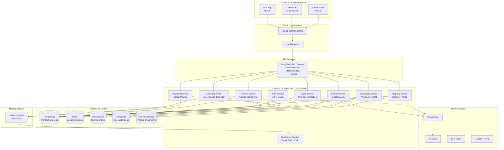
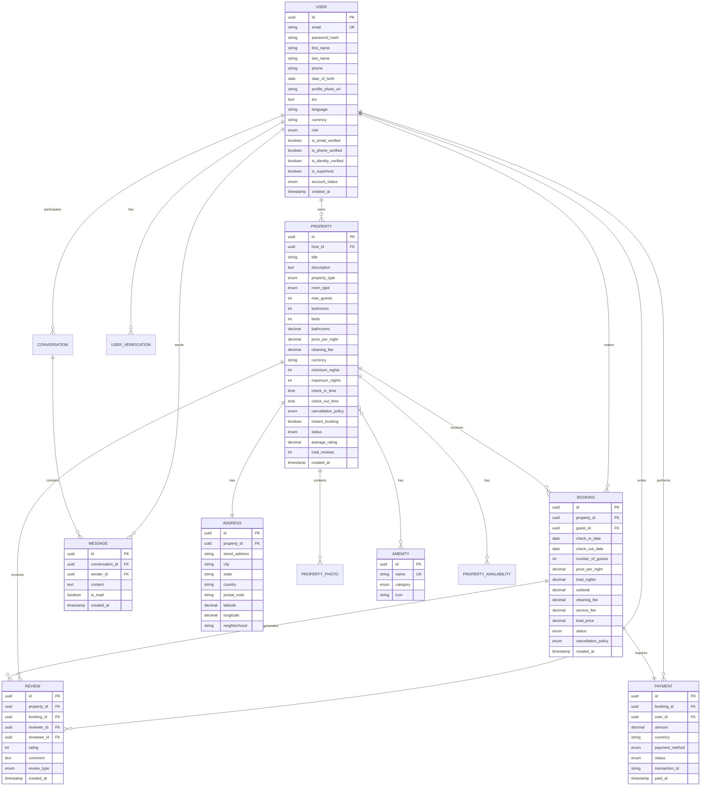
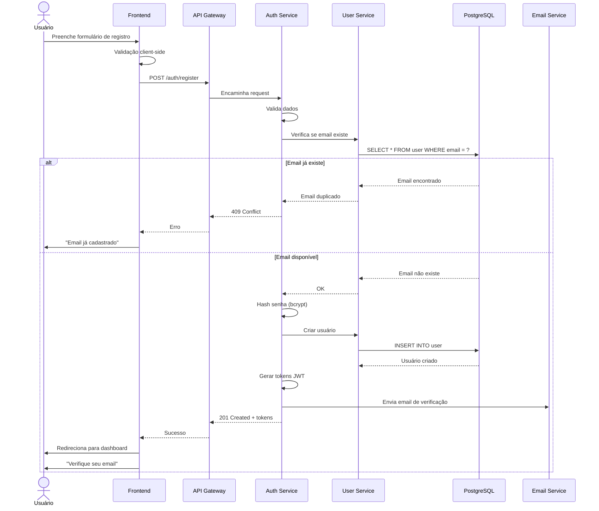
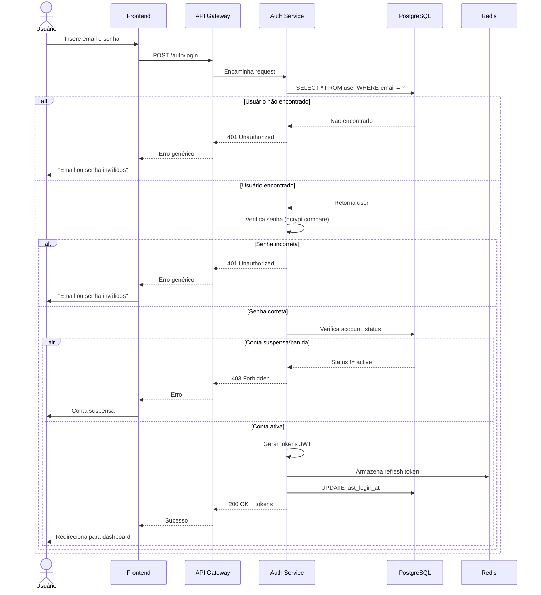
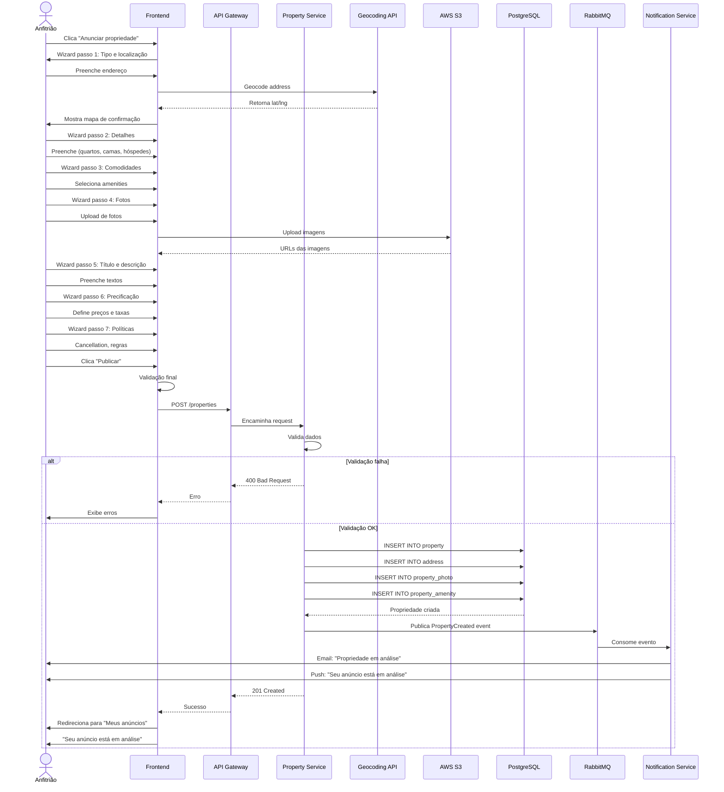
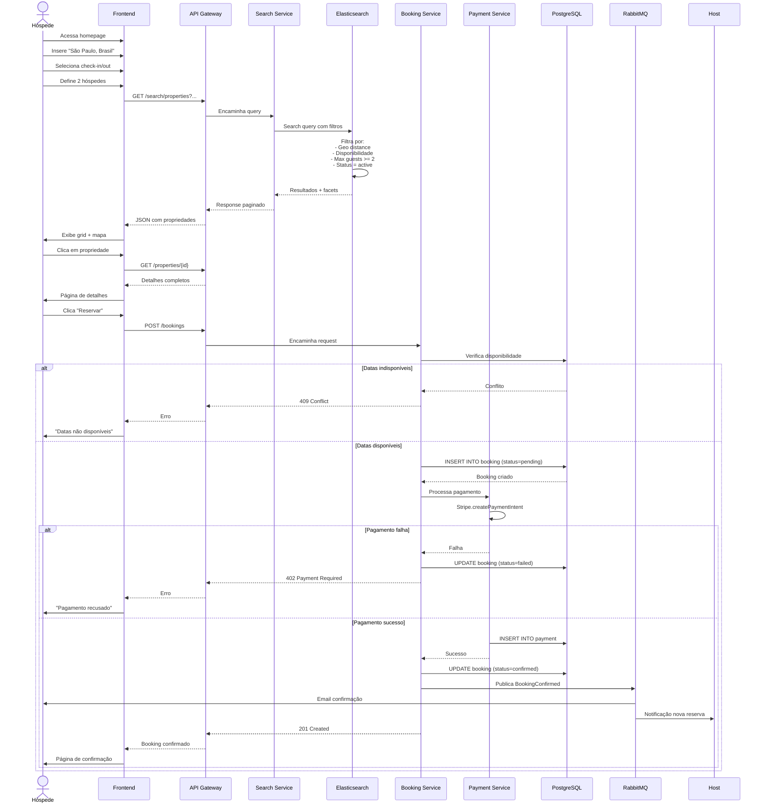
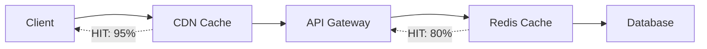

# Arquitetura do Sistema de Aluguel de Acomodações

**Versão:** 1.0  
**Data:** Fevereiro de 2026  
**Status:** Documentação Completa

---

## 📑 Índice

1. [Visão Geral](#1-visão-geral)
   - 1.1 [Introdução](#11-introdução)
   - 1.2 [Objetivos Principais](#12-objetivos-principais)
   - 1.3 [Escopo](#13-escopo)

2. [Funcionalidades Principais](#2-funcionalidades-principais)

3. [Usuários e Permissões](#3-usuários-e-permissões)
   - 3.1 [Hóspede (Guest)](#31-hóspede-guest)
   - 3.2 [Anfitrião (Host)](#32-anfitrião-host)
   - 3.3 [Administrador (Admin)](#33-administrador-admin)
   - 3.4 [Moderador (Moderator)](#34-moderador-moderator)

4. [Arquitetura do Sistema](#4-arquitetura-do-sistema)
   - 4.1 [Camada de Apresentação](#41-camada-de-apresentação)
   - 4.2 [Camada de Aplicação](#42-camada-de-aplicação)
   - 4.3 [Camada de Dados](#43-camada-de-dados)
   - 4.4 [Serviços Externos](#44-serviços-externos)

5. [Modelo de Dados](#5-modelo-de-dados)
   - 5.1 [Diagrama Entidade-Relacionamento](#51-diagrama-entidade-relacionamento)
   - 5.2 [Entidades Principais](#52-entidades-principais)

6. [API REST](#6-api-rest)
   - 6.1 [Padrões e Convenções](#61-padrões-e-convenções)
   - 6.2 [Autenticação e Autorização](#62-autenticação-e-autorização)
   - 6.3 [Versionamento](#63-versionamento)
   - 6.4 [Endpoints Principais](#64-endpoints-principais)

7. [Stack Tecnológico](#7-stack-tecnológico)
   - 7.1 [Tecnologias Recomendadas](#71-tecnologias-recomendadas)
   - 7.2 [Justificativas das Escolhas](#72-justificativas-das-escolhas)

8. [Fluxos Principais](#8-fluxos-principais)
   - 8.1 [Cadastro e Autenticação](#81-cadastro-e-autenticação)
   - 8.2 [Cadastro de Acomodação](#82-cadastro-de-acomodação)
   - 8.3 [Busca e Reserva](#83-busca-e-reserva)

9. [Considerações de Segurança](#9-considerações-de-segurança)

10. [Escalabilidade e Performance](#10-escalabilidade-e-performance)

11. [Próximos Passos](#11-próximos-passos)

[Apêndice A: Glossário](#apêndice-a-glossário)  
[Apêndice B: Referências](#apêndice-b-referências)

---

## 1. Visão Geral

### 1.1 Introdução

Este documento apresenta a arquitetura completa de um **sistema de aluguel de acomodações** (marketplace estilo Airbnb), projetado para conectar anfitriões que desejam alugar suas propriedades com hóspedes que buscam hospedagem temporária.

O sistema foi arquitetado seguindo princípios de **microserviços**, **escalabilidade horizontal**, **segregação de responsabilidades** e **segurança em camadas**, garantindo alta disponibilidade, performance e capacidade de crescimento.

### 1.2 Objetivos Principais

| Objetivo | Descrição |
|----------|-----------|
| **Escalabilidade** | Suportar de 100 usuários a 10 milhões com arquitetura que escala horizontalmente |
| **Alta Disponibilidade** | Garantir uptime de 99.9% com redundância e failover automático |
| **Performance** | Tempos de resposta < 200ms para 95% das requisições |
| **Segurança** | Conformidade com LGPD/GDPR, PCI-DSS para pagamentos, criptografia end-to-end |
| **Manutenibilidade** | Código limpo, modular, testável e bem documentado |
| **Developer Experience** | APIs RESTful intuitivas, documentação completa, ferramentas modernas |

### 1.3 Escopo

**Dentro do Escopo:**
- ✅ Gestão de usuários (hóspedes, anfitriões, administradores)
- ✅ Cadastro e gestão de propriedades
- ✅ Sistema de busca avançada com filtros geográficos
- ✅ Reservas com confirmação instantânea ou aprovação manual
- ✅ Processamento de pagamentos integrado
- ✅ Sistema de avaliações bidirecional
- ✅ Chat em tempo real entre usuários
- ✅ Painel administrativo completo
- ✅ APIs RESTful para web e mobile

**Fora do Escopo (Fase 1):**
- ❌ Experiências (passeios, eventos)
- ❌ Integração com sistemas de Smart Home
- ❌ Realidade Virtual para tours
- ❌ Blockchain para contratos

---

## 2. Funcionalidades Principais

| Módulo | Funcionalidades | Roles Permitidos |
|--------|-----------------|------------------|
| **Autenticação** | • Registro com email/senha<br>• Login com JWT<br>• OAuth 2.0 (Google, Facebook)<br>• Recuperação de senha<br>• Autenticação de dois fatores (2FA) | Todos |
| **Gestão de Usuários** | • Perfil completo com foto<br>• Verificação de identidade<br>• Verificação de email/telefone<br>• Sistema de badges (Superhost)<br>• Gestão de preferências | Todos |
| **Propriedades** | • Cadastro wizard multi-etapas<br>• Upload de até 20 fotos<br>• Geocodificação automática<br>• Calendário de disponibilidade<br>• Precificação dinâmica<br>• Gestão de comodidades | Host, Admin |
| **Busca e Filtros** | • Busca por localização geográfica<br>• Filtros: preço, data, hóspedes, tipo<br>• Autocomplete de localização<br>• Mapas interativos<br>• Ordenação por relevância/preço/avaliação | Todos |
| **Reservas** | • Reserva instantânea ou com aprovação<br>• Cálculo automático de preços<br>• Políticas de cancelamento flexíveis<br>• Check-in/Check-out digital<br>• Modificação de reservas | Guest, Host, Admin |
| **Pagamentos** | • Múltiplos métodos (cartão, PIX, carteira)<br>• Split payment (host + plataforma)<br>• Retenção de pagamento até check-in<br>• Reembolsos automáticos<br>• Histórico financeiro | Guest, Host, Admin |
| **Avaliações** | • Avaliação bidirecional (host ↔ guest)<br>• Sistema de 5 estrelas + comentários<br>• Período de 14 dias para avaliar<br>• Moderação de conteúdo<br>• Resposta do anfitrião | Guest, Host |
| **Mensagens** | • Chat em tempo real (WebSocket)<br>• Notificações push<br>• Histórico persistente<br>• Compartilhamento de mídia<br>• Templates de resposta automática | Guest, Host |
| **Administração** | • Dashboard com métricas<br>• Gestão de usuários e propriedades<br>• Moderação de avaliações<br>• Resolução de disputas<br>• Configurações globais | Admin, Moderator |

---

## 3. Usuários e Permissões

O sistema implementa **RBAC (Role-Based Access Control)** com 4 papéis principais:

### 3.1 Hóspede (Guest)

**Descrição:** Usuário que busca e reserva acomodações.

#### Matriz de Permissões

| Módulo | Criar | Visualizar | Editar | Excluir | Ações Especiais |
|--------|-------|------------|--------|---------|-----------------|
| **Usuários** | ✅ Próprio cadastro | ✅ Próprio perfil<br>✅ Perfis públicos | ✅ Próprio perfil | ✅ Própria conta | • Verificar identidade<br>• Alterar senha |
| **Acomodações** | ❌ | ✅ Todas públicas | ❌ | ❌ | • Favoritar<br>• Compartilhar |
| **Reservas** | ✅ Próprias | ✅ Próprias<br>✅ Histórico | ✅ Modificar datas* | ✅ Cancelar* | • Reserva instantânea |
| **Pagamentos** | ✅ Realizar | ✅ Próprios | ❌ | ❌ | • Adicionar método<br>• Aplicar cupom |
| **Avaliações** | ✅ Após estadia | ✅ Próprias<br>✅ Públicas | ✅ Editar (48h)* | ❌ | • Denunciar |
| **Mensagens** | ✅ Iniciar | ✅ Próprias | ✅ Próprias | ❌ | • Bloquear usuário |

#### Regras de Negócio Principais

- **RN-G01:** Só pode reservar com método de pagamento válido cadastrado
- **RN-G02:** Só pode avaliar após conclusão da estadia
- **RN-G03:** Pode editar avaliação apenas nas primeiras 48h
- **RN-G04:** Não pode reservar se tiver pendências de pagamento
- **RN-G05:** Cancelamento segue política da propriedade
- **RN-G10:** Precisa verificar email para primeira reserva

### 3.2 Anfitrião (Host)

**Descrição:** Usuário que disponibiliza acomodações para aluguel.

#### Matriz de Permissões

| Módulo | Criar | Visualizar | Editar | Excluir | Ações Especiais |
|--------|-------|------------|--------|---------|-----------------|
| **Usuários** | ✅ Próprio cadastro | ✅ Próprio perfil<br>✅ Perfis públicos | ✅ Próprio perfil | ✅ Própria conta | • Solicitar Superhost |
| **Acomodações** | ✅ Ilimitadas* | ✅ Próprias<br>✅ Estatísticas | ✅ Próprias | ✅ Próprias* | • Ativar/Pausar<br>• Clonar anúncio |
| **Reservas** | ❌ | ✅ Suas propriedades<br>✅ Calendário | ✅ Status | ❌ | • Aprovar/Rejeitar<br>• Bloquear datas |
| **Pagamentos** | ❌ | ✅ Recebimentos<br>✅ Extratos | ✅ Dados bancários | ❌ | • Solicitar antecipação |
| **Avaliações** | ✅ Avaliar hóspedes | ✅ Recebidas<br>✅ Próprias | ✅ Editar (48h)* | ❌ | • Responder avaliações |
| **Mensagens** | ✅ Responder | ✅ Suas propriedades | ✅ Próprias | ❌ | • Templates |

#### Regras de Negócio Principais

- **RN-H01:** Precisa identidade verificada para primeira propriedade
- **RN-H02:** Limite de 100 propriedades (aumentável)
- **RN-H03:** Só edita/exclui sem reservas ativas futuras
- **RN-H04:** Deve responder solicitações em até 24h
- **RN-H07:** Recebe pagamento 24h após check-in
- **RN-H09:** Taxa de cancelamento > 10% perde Superhost
- **RN-H12:** Taxa de resposta > 90% para manter visibilidade

### 3.3 Administrador (Admin)

**Descrição:** Permissões totais para gestão da plataforma.

#### Matriz de Permissões

| Módulo | Criar | Visualizar | Editar | Excluir | Ações Especiais |
|--------|-------|------------|--------|---------|-----------------|
| **Usuários** | ✅ Todos os tipos | ✅ Todos<br>✅ Dados completos | ✅ Qualquer perfil | ✅ Qualquer conta* | • Suspender/Banir<br>• Resetar senha |
| **Acomodações** | ✅ Em nome de | ✅ Todas | ✅ Qualquer | ✅ Qualquer* | • Aprovar/Reprovar<br>• Destacar |
| **Reservas** | ✅ Manual | ✅ Todas | ✅ Qualquer* | ✅ Qualquer* | • Cancelar sem penalidade<br>• Resolver disputas |
| **Pagamentos** | ✅ Ajustes | ✅ Todas<br>✅ Dados completos | ✅ Status | ❌ | • Reembolsar<br>• Estornar |
| **Avaliações** | ❌ | ✅ Todas<br>✅ Denúncias | ✅ Qualquer* | ✅ Remover* | • Moderar<br>• Banir por violação |
| **Mensagens** | ✅ Suporte oficial | ✅ Todas | ❌ | ✅ Inadequadas | • Intervir<br>• Exportar histórico |
| **Relatórios** | ✅ Customizados | ✅ Todos<br>✅ Métricas globais | ✅ KPIs | ❌ | • Analytics completo |
| **Configurações** | ✅ Novas | ✅ Todas | ✅ Globais | ✅ Obsoletas | • Alterar taxas<br>• Feature flags |

#### Regras de Negócio Principais

- **RN-A01:** Deve registrar motivo para ações críticas
- **RN-A03:** Ações de alto impacto requerem 2FA
- **RN-A05:** Exclusão permanente requer aprovação de 2 admins
- **RN-A09:** Deve respeitar LGPD/GDPR
- **RN-A10:** Logs de ações são permanentes

### 3.4 Moderador (Moderator)

**Descrição:** Permissões intermediárias focadas em curadoria de conteúdo.

#### Principais Diferenças do Admin

- ❌ Sem acesso a dados financeiros sensíveis
- ❌ Não pode excluir usuários permanentemente
- ✅ Pode aprovar/reprovar anúncios
- ✅ Pode moderar avaliações
- ✅ Pode suspender temporariamente (24h)
- ✅ Pode escalar para admin quando necessário

---

## 4. Arquitetura do Sistema

### Diagrama de Arquitetura em Camadas



### 4.1 Camada de Apresentação

#### Web Application (Next.js 14+)

**Características:**
- Server-Side Rendering (SSR) para SEO
- Static Site Generation (SSG) para páginas de listagem
- React Server Components
- Image optimization automática
- Code splitting por rota

**Casos de Uso:**
- Homepage com busca
- Listagens de propriedades
- Páginas de detalhes (SEO-optimized)
- Dashboard de usuário
- Checkout e pagamentos

#### Mobile Application (React Native + Expo)

**Características:**
- Cross-platform (iOS + Android)
- Over-the-Air (OTA) updates via Expo
- Push notifications nativas
- Geolocation
- Camera para upload de fotos

**Casos de Uso:**
- Busca mobile-first
- Chat em tempo real
- Notificações push
- Check-in/check-out digital

#### Admin Panel (Next.js)

**Características:**
- Dashboards com métricas
- Tabelas com filtros avançados
- Gestão de usuários e propriedades
- Moderação de conteúdo
- Relatórios customizados

### 4.2 Camada de Aplicação

#### API Gateway (Kong/AWS API Gateway)

**Responsabilidades:**
- Autenticação centralizada (JWT validation)
- Rate limiting por usuário/IP
- Roteamento para microserviços
- Circuit breaker e retry logic
- Versionamento de API

#### Microserviços

| Serviço | Responsabilidade | Banco de Dados | Escalabilidade |
|---------|------------------|----------------|----------------|
| **Auth Service** | JWT, OAuth, 2FA | PostgreSQL, Redis | 3-10 pods |
| **User Service** | Perfis, verificação | PostgreSQL | 5-15 pods |
| **Property Service** | Listagens, fotos | PostgreSQL, S3 | 5-20 pods |
| **Search Service** | Busca, filtros | Elasticsearch | 10-50 pods |
| **Booking Service** | Reservas, calendário | PostgreSQL | 5-20 pods |
| **Payment Service** | Pagamentos, split | PostgreSQL | 3-10 pods |
| **Message Service** | Chat, WebSocket | MongoDB, Redis | 5-20 pods |
| **Review Service** | Avaliações | PostgreSQL | 3-10 pods |
| **Notification Service** | Email, SMS, push | Queue-based | 2-10 pods |

### 4.3 Camada de Dados

#### PostgreSQL (Dados Transacionais)

**Uso:**
- Usuários, propriedades, reservas, pagamentos
- Relações complexas com ACID
- Particionamento por bounded context

**Configuração:**
- Primary + 2 réplicas de leitura
- Connection pooling (PgBouncer)
- Backup automático diário

#### Redis (Cache e Sessões)

**Uso:**
- Cache de queries frequentes
- Sessões JWT (blacklist de tokens revogados)
- Rate limiting counters
- Pub/Sub para WebSocket

**Configuração:**
- Cluster 3 nós
- TTL configurável por tipo
- Persistence opcional (RDB + AOF)

#### Elasticsearch (Search Engine)

**Uso:**
- Busca full-text em propriedades
- Filtros facetados (preço, comodidades)
- Geo-queries (proximidade)
- Autocomplete

**Configuração:**
- 5 nós cluster
- Sincronização via CDC (Debezium)
- Índices com replicas

#### MongoDB (Dados Semi-Estruturados)

**Uso:**
- Histórico de mensagens
- Logs de eventos
- Analytics events

### 4.4 Serviços Externos

| Serviço | Provedor Recomendado | Uso |
|---------|---------------------|-----|
| **Armazenamento** | AWS S3, Cloudflare R2 | Fotos de propriedades, documentos |
| **CDN** | CloudFront, Cloudflare | Assets estáticos, imagens |
| **Email** | SendGrid, AWS SES | Emails transacionais, marketing |
| **SMS** | Twilio, AWS SNS | Códigos de verificação |
| **Pagamentos** | Stripe, PayPal | Processamento de pagamentos |
| **Maps** | Google Maps, Mapbox | Geocoding, mapas interativos |
| **Push Notifications** | Firebase Cloud Messaging | Notificações mobile |
| **Monitoramento** | Datadog, New Relic | APM, logs, traces |

---

## 5. Modelo de Dados

### 5.1 Diagrama Entidade-Relacionamento



### 5.2 Entidades Principais

#### 5.2.1 USER (Usuários)

**Descrição:** Armazena todos os usuários da plataforma.

| Atributo | Tipo | Descrição | Constraints |
|----------|------|-----------|-------------|
| `id` | UUID | Identificador único | PK, NOT NULL |
| `email` | VARCHAR(255) | Email do usuário | UNIQUE, NOT NULL |
| `password_hash` | VARCHAR(255) | Hash bcrypt da senha | NOT NULL |
| `first_name` | VARCHAR(100) | Primeiro nome | NOT NULL |
| `last_name` | VARCHAR(100) | Sobrenome | NOT NULL |
| `phone` | VARCHAR(20) | Telefone com código país | NULLABLE |
| `date_of_birth` | DATE | Data de nascimento | CHECK (age >= 18) |
| `profile_photo_url` | VARCHAR(500) | URL da foto de perfil | NULLABLE |
| `bio` | TEXT | Biografia | NULLABLE |
| `language` | VARCHAR(10) | Idioma preferido (ISO 639-1) | NOT NULL, DEFAULT 'en' |
| `currency` | VARCHAR(3) | Moeda preferida (ISO 4217) | NOT NULL, DEFAULT 'USD' |
| `role` | ENUM | guest, host, admin, moderator | NOT NULL |
| `is_email_verified` | BOOLEAN | Email verificado | NOT NULL, DEFAULT false |
| `is_phone_verified` | BOOLEAN | Telefone verificado | NOT NULL, DEFAULT false |
| `is_identity_verified` | BOOLEAN | Identidade verificada | NOT NULL, DEFAULT false |
| `is_superhost` | BOOLEAN | Status de Superhost | NOT NULL, DEFAULT false |
| `account_status` | ENUM | active, suspended, banned | NOT NULL, DEFAULT 'active' |
| `created_at` | TIMESTAMP | Data de criação | NOT NULL, DEFAULT NOW() |
| `updated_at` | TIMESTAMP | Data de atualização | NOT NULL, DEFAULT NOW() |

**Índices:**
```sql
CREATE UNIQUE INDEX idx_user_email ON user(email) WHERE deleted_at IS NULL;
CREATE INDEX idx_user_role ON user(role);
CREATE INDEX idx_user_account_status ON user(account_status);
CREATE INDEX idx_user_is_superhost ON user(is_superhost) WHERE is_superhost = true;
```

#### 5.2.2 PROPERTY (Propriedades)

**Descrição:** Representa as acomodações disponíveis para aluguel.

| Atributo | Tipo | Descrição | Constraints |
|----------|------|-----------|-------------|
| `id` | UUID | Identificador único | PK, NOT NULL |
| `host_id` | UUID | FK para User (anfitrião) | FK, NOT NULL |
| `title` | VARCHAR(255) | Título do anúncio | NOT NULL, LENGTH >= 10 |
| `description` | TEXT | Descrição completa | NOT NULL, LENGTH >= 50 |
| `property_type` | ENUM | apartment, house, villa, room | NOT NULL |
| `room_type` | ENUM | entire_place, private_room, shared_room | NOT NULL |
| `max_guests` | INTEGER | Número máximo de hóspedes | CHECK (1 <= max_guests <= 16) |
| `bedrooms` | INTEGER | Número de quartos | CHECK (bedrooms >= 0) |
| `beds` | INTEGER | Número de camas | CHECK (beds > 0) |
| `bathrooms` | DECIMAL(3,1) | Número de banheiros | CHECK (bathrooms > 0) |
| `price_per_night` | DECIMAL(10,2) | Preço por noite | CHECK (price > 0) |
| `cleaning_fee` | DECIMAL(10,2) | Taxa de limpeza | CHECK (fee >= 0) |
| `currency` | VARCHAR(3) | Moeda (ISO 4217) | NOT NULL, DEFAULT 'USD' |
| `minimum_nights` | INTEGER | Estadia mínima | CHECK (min > 0) |
| `maximum_nights` | INTEGER | Estadia máxima | CHECK (max <= 365) |
| `check_in_time` | TIME | Horário de check-in | NOT NULL |
| `check_out_time` | TIME | Horário de check-out | NOT NULL |
| `cancellation_policy` | ENUM | flexible, moderate, strict | NOT NULL |
| `instant_booking` | BOOLEAN | Reserva instantânea | NOT NULL, DEFAULT false |
| `status` | ENUM | draft, pending_approval, active, paused | NOT NULL |
| `average_rating` | DECIMAL(3,2) | Avaliação média | CHECK (0 <= rating <= 5) |
| `total_reviews` | INTEGER | Total de avaliações | NOT NULL, DEFAULT 0 |

**Índices:**
```sql
CREATE INDEX idx_property_host_id ON property(host_id);
CREATE INDEX idx_property_status ON property(status);
CREATE INDEX idx_property_price ON property(price_per_night);
CREATE INDEX idx_property_rating ON property(average_rating DESC);
CREATE INDEX idx_property_instant_booking ON property(instant_booking) WHERE instant_booking = true;
```

#### 5.2.3 BOOKING (Reservas)

**Descrição:** Representa as reservas de propriedades.

| Atributo | Tipo | Descrição | Constraints |
|----------|------|-----------|-------------|
| `id` | UUID | Identificador único | PK, NOT NULL |
| `property_id` | UUID | FK para Property | FK, NOT NULL |
| `guest_id` | UUID | FK para User | FK, NOT NULL |
| `check_in_date` | DATE | Data de check-in | NOT NULL |
| `check_out_date` | DATE | Data de check-out | CHECK (out > in) |
| `number_of_guests` | INTEGER | Número de hóspedes | CHECK (guests > 0) |
| `price_per_night` | DECIMAL(10,2) | Preço congelado | NOT NULL |
| `total_nights` | INTEGER | Total de noites | COMPUTED |
| `subtotal` | DECIMAL(10,2) | Subtotal (noites × preço) | NOT NULL |
| `cleaning_fee` | DECIMAL(10,2) | Taxa de limpeza | NOT NULL, DEFAULT 0 |
| `service_fee` | DECIMAL(10,2) | Taxa da plataforma | NOT NULL |
| `total_price` | DECIMAL(10,2) | Preço total | NOT NULL |
| `status` | ENUM | pending, confirmed, cancelled, completed | NOT NULL |
| `cancellation_policy` | ENUM | flexible, moderate, strict | NOT NULL |
| `created_at` | TIMESTAMP | Data da reserva | NOT NULL |

**Constraints:**
```sql
ALTER TABLE booking
ADD CONSTRAINT check_dates CHECK (check_out_date > check_in_date);

ALTER TABLE booking
ADD CONSTRAINT check_future_dates CHECK (check_in_date >= CURRENT_DATE);

-- Evitar reservas sobrepostas
CREATE UNIQUE INDEX idx_booking_no_overlap ON booking(property_id, check_in_date, check_out_date)
WHERE status IN ('pending', 'confirmed');
```

#### 5.2.4 PAYMENT (Pagamentos)

**Descrição:** Registra transações financeiras.

| Atributo | Tipo | Descrição | Constraints |
|----------|------|-----------|-------------|
| `id` | UUID | Identificador único | PK, NOT NULL |
| `booking_id` | UUID | FK para Booking | FK, NOT NULL |
| `user_id` | UUID | FK para User | FK, NOT NULL |
| `amount` | DECIMAL(10,2) | Valor do pagamento | CHECK (amount > 0) |
| `currency` | VARCHAR(3) | Moeda | NOT NULL |
| `payment_method` | ENUM | credit_card, debit_card, pix, wallet | NOT NULL |
| `status` | ENUM | pending, processing, completed, failed, refunded | NOT NULL |
| `transaction_id` | VARCHAR(255) | ID do gateway | UNIQUE, NOT NULL |
| `paid_at` | TIMESTAMP | Data do pagamento | NULLABLE |
| `refunded_at` | TIMESTAMP | Data do reembolso | NULLABLE |

#### 5.2.5 REVIEW (Avaliações)

**Descrição:** Sistema de avaliações bidirecional.

| Atributo | Tipo | Descrição | Constraints |
|----------|------|-----------|-------------|
| `id` | UUID | Identificador único | PK, NOT NULL |
| `property_id` | UUID | FK para Property | FK, NOT NULL |
| `booking_id` | UUID | FK para Booking | FK, NOT NULL |
| `reviewer_id` | UUID | Quem avalia | FK, NOT NULL |
| `reviewee_id` | UUID | Quem é avaliado | FK, NOT NULL |
| `rating` | INTEGER | Nota (1-5) | CHECK (1 <= rating <= 5) |
| `comment` | TEXT | Comentário | NOT NULL, LENGTH >= 10 |
| `review_type` | ENUM | guest_to_host, host_to_guest | NOT NULL |
| `created_at` | TIMESTAMP | Data da avaliação | NOT NULL |

**Constraints:**
```sql
-- Uma review por booking por tipo
CREATE UNIQUE INDEX idx_review_unique ON review(booking_id, review_type);

-- Apenas após checkout
ALTER TABLE review
ADD CONSTRAINT check_after_checkout 
CHECK (created_at > (SELECT check_out_date FROM booking WHERE id = booking_id));
```

---

## 6. API REST

### 6.1 Padrões e Convenções

#### Base URL
```
https://api.nomadia.com/v1
```

#### Formato de Resposta

**Sucesso:**
```json
{
  "data": { ... },
  "meta": {
    "timestamp": "2026-02-04T10:30:00Z",
    "version": "1.0"
  }
}
```

**Erro:**
```json
{
  "error": {
    "code": "INVALID_INPUT",
    "message": "Email já cadastrado",
    "details": {
      "field": "email",
      "value": "user@example.com"
    }
  },
  "meta": {
    "timestamp": "2026-02-04T10:30:00Z"
  }
}
```

#### Paginação

**Query Params:**
```
?page=1&limit=20&sort=-created_at
```

**Resposta:**
```json
{
  "data": [...],
  "pagination": {
    "page": 1,
    "limit": 20,
    "total": 150,
    "totalPages": 8,
    "hasNext": true,
    "hasPrev": false
  }
}
```

#### Códigos HTTP

| Código | Uso |
|--------|-----|
| `200 OK` | Sucesso em leitura |
| `201 Created` | Recurso criado |
| `204 No Content` | Sucesso em exclusão |
| `400 Bad Request` | Dados inválidos |
| `401 Unauthorized` | Não autenticado |
| `403 Forbidden` | Sem permissão |
| `404 Not Found` | Recurso não encontrado |
| `409 Conflict` | Conflito (ex: reserva sobreposta) |
| `422 Unprocessable Entity` | Validação de negócio falhou |
| `429 Too Many Requests` | Rate limit excedido |
| `500 Internal Server Error` | Erro no servidor |

### 6.2 Autenticação e Autorização

#### JWT (JSON Web Token)

**Header:**
```
Authorization: Bearer <access_token>
```

**Token Structure:**
```json
{
  "sub": "uuid",
  "email": "user@example.com",
  "role": "guest",
  "iat": 1707048000,
  "exp": 1707048900
}
```

**Duração:**
- Access Token: 15 minutos
- Refresh Token: 7 dias

#### Rate Limiting

| Tipo de Usuário | Limite |
|-----------------|--------|
| **Anônimo** | 100 req/15min |
| **Autenticado** | 1000 req/15min |
| **Admin** | 5000 req/15min |

### 6.3 Versionamento

**Estratégia:** URL path versioning

```
/v1/users
/v2/users  (quando houver breaking changes)
```

**Deprecation Policy:**
- Versões antigas mantidas por 12 meses
- Warning header: `Sunset: Sat, 31 Dec 2027 23:59:59 GMT`

### 6.4 Endpoints Principais

#### Autenticação

| Método | Endpoint | Descrição | Auth |
|--------|----------|-----------|------|
| `POST` | `/auth/register` | Registro de usuário | Público |
| `POST` | `/auth/login` | Login | Público |
| `POST` | `/auth/refresh` | Renovar token | Público |
| `POST` | `/auth/logout` | Logout | Autenticado |
| `POST` | `/auth/forgot-password` | Esqueci senha | Público |
| `POST` | `/auth/reset-password` | Redefinir senha | Público |

#### Usuários

| Método | Endpoint | Descrição | Auth |
|--------|----------|-----------|------|
| `GET` | `/users/me` | Perfil atual | Autenticado |
| `PATCH` | `/users/me` | Atualizar perfil | Autenticado |
| `POST` | `/users/me/profile-photo` | Upload foto | Autenticado |
| `GET` | `/users/{id}` | Perfil público | Público |
| `POST` | `/users/me/verify-email` | Verificar email | Autenticado |
| `POST` | `/users/me/verify-phone` | Verificar telefone | Autenticado |
| `POST` | `/users/me/verify-identity` | Verificar identidade | Autenticado |
| `GET` | `/users` | Listar usuários | Admin |
| `POST` | `/users/{id}/suspend` | Suspender usuário | Admin |

#### Propriedades

| Método | Endpoint | Descrição | Auth |
|--------|----------|-----------|------|
| `POST` | `/properties` | Criar propriedade | Host |
| `GET` | `/properties` | Listar propriedades | Público |
| `GET` | `/properties/{id}` | Detalhes | Público |
| `PATCH` | `/properties/{id}` | Atualizar | Host |
| `DELETE` | `/properties/{id}` | Deletar | Host |
| `POST` | `/properties/{id}/photos` | Upload fotos | Host |
| `PATCH` | `/properties/{id}/photos/{photoId}` | Reordenar fotos | Host |
| `POST` | `/properties/{id}/publish` | Publicar | Host |
| `POST` | `/properties/{id}/pause` | Pausar anúncio | Host |

#### Busca

| Método | Endpoint | Descrição | Auth |
|--------|----------|-----------|------|
| `GET` | `/search/properties` | Busca avançada | Público |
| `GET` | `/search/autocomplete` | Autocomplete | Público |
| `GET` | `/search/map` | Busca no mapa | Público |

**Query Params:**
```
?location=São Paulo, Brazil
&checkIn=2026-03-15
&checkOut=2026-03-20
&guests=2
&minPrice=50
&maxPrice=200
&propertyType=apartment
&amenities=wifi,pool
&instantBooking=true
&sortBy=price
```

#### Reservas

| Método | Endpoint | Descrição | Auth |
|--------|----------|-----------|------|
| `POST` | `/bookings` | Criar reserva | Guest |
| `GET` | `/bookings` | Listar minhas reservas | Autenticado |
| `GET` | `/bookings/{id}` | Detalhes | Autenticado |
| `PATCH` | `/bookings/{id}` | Modificar reserva | Guest |
| `POST` | `/bookings/{id}/cancel` | Cancelar | Guest/Host |
| `POST` | `/bookings/{id}/approve` | Aprovar (não instantânea) | Host |
| `POST` | `/bookings/{id}/reject` | Rejeitar | Host |

#### Pagamentos

| Método | Endpoint | Descrição | Auth |
|--------|----------|-----------|------|
| `POST` | `/payments` | Processar pagamento | Guest |
| `GET` | `/payments` | Histórico | Autenticado |
| `GET` | `/payments/{id}` | Detalhes | Autenticado |
| `POST` | `/payments/{id}/refund` | Reembolsar | Admin |

#### Avaliações

| Método | Endpoint | Descrição | Auth |
|--------|----------|-----------|------|
| `POST` | `/reviews` | Criar avaliação | Autenticado |
| `GET` | `/reviews` | Listar avaliações | Público |
| `GET` | `/reviews/{id}` | Detalhes | Público |
| `PATCH` | `/reviews/{id}` | Editar (48h) | Autor |
| `DELETE` | `/reviews/{id}` | Deletar | Admin |
| `POST` | `/reviews/{id}/response` | Responder | Reviewee |
| `POST` | `/reviews/{id}/report` | Denunciar | Autenticado |

#### Mensagens

| Método | Endpoint | Descrição | Auth |
|--------|----------|-----------|------|
| `GET` | `/conversations` | Listar conversas | Autenticado |
| `GET` | `/conversations/{id}` | Detalhes conversa | Autenticado |
| `POST` | `/conversations` | Iniciar conversa | Autenticado |
| `GET` | `/conversations/{id}/messages` | Mensagens | Autenticado |
| `POST` | `/conversations/{id}/messages` | Enviar mensagem | Autenticado |
| `PATCH` | `/messages/{id}/read` | Marcar lida | Autenticado |

**WebSocket para tempo real:**
```
wss://ws.nomadia.com/v1/messages?token=<jwt>
```

---

## 7. Stack Tecnológico

### 7.1 Tecnologias Recomendadas

| Camada | Tecnologia | Versão | Justificativa |
|--------|-----------|--------|---------------|
| **Frontend Web** | Next.js | 14+ | SSR/SSG para SEO, React ecosystem, Vercel deployment |
| **Frontend Mobile** | React Native + Expo | Latest | Cross-platform, code sharing, OTA updates |
| **Backend** | Node.js + NestJS | 20 LTS / 10+ | TypeScript, microservices, async I/O |
| **API Gateway** | Kong | 3+ | Open-source, plugins, rate limiting |
| **Database (SQL)** | PostgreSQL | 15+ | ACID, JSONB, PostGIS, partitioning |
| **Cache** | Redis | 7+ | In-memory, pub/sub, sessions |
| **Search Engine** | Elasticsearch | 8+ | Full-text, geo queries, facets |
| **Message Queue** | RabbitMQ | 3.12+ | Reliable, clustering, dead-letter queues |
| **Storage** | AWS S3 / R2 | - | Scalable, CDN-ready |
| **CDN** | Cloudflare | - | Global edge, DDoS protection |
| **Email** | SendGrid | - | Reliable, templates, analytics |
| **SMS** | Twilio | - | Global coverage, verify API |
| **Payments** | Stripe | - | PCI compliant, split payments |
| **Maps** | Mapbox | - | Geocoding, interactive maps |
| **Monitoring** | Prometheus + Grafana | - | Metrics, dashboards |
| **Logging** | ELK Stack | 8+ | Centralized logs, search |
| **Tracing** | Jaeger | - | Distributed tracing |
| **Container** | Docker | 24+ | Containerization |
| **Orchestration** | Kubernetes | 1.28+ | Auto-scaling, self-healing |
| **CI/CD** | GitHub Actions | - | Automated pipelines |

### 7.2 Justificativas das Escolhas

#### Frontend: Next.js 14+

**Por que Next.js:**
- ✅ **SEO crítico:** SSR nativo para páginas de listagem indexadas pelo Google
- ✅ **Performance:** ISR (Incremental Static Regeneration) para páginas semi-estáticas
- ✅ **Image optimization:** Componente `<Image>` com lazy loading e WebP
- ✅ **API Routes:** Backend leve integrado
- ✅ **Ecossistema React:** Maior disponibilidade de desenvolvedores

**Alternativas Consideradas:**
- Nuxt 3 (Vue): Sintaxe mais simples, mas ecossistema menor
- SvelteKit: Performance excepcional, mas menos desenvolvedores

#### Backend: Node.js + NestJS

**Por que NestJS:**
- ✅ **TypeScript first:** Type safety end-to-end
- ✅ **Arquitetura enterprise:** Dependency injection, modules, decorators
- ✅ **Async nativo:** Perfect for I/O-bound operations (APIs, DB)
- ✅ **Microservices ready:** Built-in support para gRPC, MQTT, Redis
- ✅ **Testing:** Jest integrado, easy mocking

**Alternativas Consideradas:**
- FastAPI (Python): Excelente para ML, mas Python não é ideal para concorrência
- Go: Performance superior, mas verboso e menos libraries
- Spring Boot: Enterprise-grade, mas startup lento e verbose

#### Database: PostgreSQL 15+

**Por que PostgreSQL:**
- ✅ **ACID completo:** Crítico para transações de reserva e pagamento
- ✅ **PostGIS:** Queries geográficas nativas (`ST_Distance`, `ST_Within`)
- ✅ **JSONB:** Flexibilidade para dados semi-estruturados
- ✅ **Partitioning:** Escalabilidade vertical e horizontal
- ✅ **Full-text search:** Busca básica sem Elasticsearch

**Alternativas Consideradas:**
- MySQL: Reads rápidos, mas menos features avançadas
- CockroachDB: Geo-distributed, mas complexo e caro para começar

#### Search Engine: Elasticsearch

**Por que Elasticsearch:**
- ✅ **Full-text search:** Busca por "apartamento perto da praia"
- ✅ **Faceted search:** Filtros múltiplos simultâneos (preço + comodidades + localização)
- ✅ **Geo queries:** `geo_distance`, `geo_bounding_box` com performance
- ✅ **Aggregations:** Contar resultados por faixa de preço
- ✅ **Real-time:** Indexação incremental

**Alternativas Consideradas:**
- Algolia: Excelente, mas caro para grande volume
- Meilisearch: Open-source, mas menos features
- PostgreSQL full-text: Limitado para queries complexas

#### Message Queue: RabbitMQ

**Por que RabbitMQ:**
- ✅ **Reliability:** Acknowledgments, dead-letter queues, persistence
- ✅ **Routing:** Exchange patterns (direct, topic, fanout)
- ✅ **Clustering:** High availability nativo
- ✅ **Management UI:** Fácil monitoramento

**Alternativas Consideradas:**
- Apache Kafka: Overkill para começar, complexo
- AWS SQS: Simples, mas vendor lock-in
- Redis Streams: Leve, mas menos features de routing

#### Payments: Stripe

**Por que Stripe:**
- ✅ **PCI compliant:** Não armazenamos dados de cartão
- ✅ **Split payments:** Stripe Connect para marketplace
- ✅ **Webhooks:** Notificações assíncronas
- ✅ **Dashboard:** Gestão financeira completa
- ✅ **Global:** Suporte a 135+ moedas

**Alternativas Consideradas:**
- PayPal: Popular, mas taxas maiores
- Mercado Pago: LATAM focus, mas limitado globalmente

---

## 8. Fluxos Principais

### 8.1 Cadastro e Autenticação

#### F1.1 - Registro de Novo Usuário



**Regras de Negócio:**
- Senha mínima: 8 caracteres, 1 maiúscula, 1 número, 1 especial
- Usuário deve ter no mínimo 18 anos
- Email único na plataforma
- Access token expira em 15 minutos
- Email de verificação expira em 24 horas

#### F1.2 - Login



**Regras de Negócio:**
- Rate limiting: máximo 5 tentativas/minuto por IP
- Mensagem de erro genérica (evitar enumeração de emails)
- Bloqueio temporário após 5 tentativas falhas (15 min)
- Last_login_at atualizado em cada login

### 8.2 Cadastro de Acomodação

#### F2.1 - Criação de Nova Propriedade



**Regras de Negócio:**
- Mínimo 3 fotos obrigatórias
- Descrição mínima de 50 caracteres
- Anfitrião deve ter email verificado
- Propriedade criada com status `pending_approval`
- Admin/Moderador deve aprovar antes de ficar visível

### 8.3 Busca e Reserva

#### F3.1 - Busca por Localização e Reserva



**Regras de Negócio:**
- Check-out deve ser posterior a check-in
- Não é possível reservar datas passadas
- Máximo 365 noites por reserva
- Número de hóspedes <= max_guests da propriedade
- Preço é congelado no momento da reserva
- Pagamento processado apenas após confirmação de disponibilidade

---

## 9. Considerações de Segurança

### 9.1 Autenticação e Autorização

| Medida | Implementação |
|--------|---------------|
| **JWT** | • Access token: 15 min<br>• Refresh token: 7 dias<br>• RS256 (asymmetric) |
| **2FA** | • TOTP (Google Authenticator)<br>• SMS backup<br>• Obrigatório para admins |
| **Password Policy** | • Mínimo 8 caracteres<br>• Bcrypt cost factor 12<br>• Histórico de senhas (últimas 3) |
| **Rate Limiting** | • Login: 5 tentativas/15min<br>• API geral: 1000 req/15min<br>• IP + user-based |
| **Session Management** | • Redis para blacklist de tokens revogados<br>• Logout invalida todos os tokens |

### 9.2 Comunicação

| Camada | Medida |
|--------|--------|
| **TLS** | • TLS 1.3 obrigatório<br>• HSTS header<br>• Certificate pinning no mobile |
| **mTLS** | • Entre microservices internos<br>• Service mesh (Istio/Linkerd) |
| **API Gateway** | • WAF (Web Application Firewall)<br>• DDoS protection (Cloudflare) |

### 9.3 Dados Sensíveis

| Tipo de Dado | Proteção |
|--------------|----------|
| **At-Rest** | • PostgreSQL: encryption at rest<br>• S3: AES-256<br>• Backups criptografados |
| **In-Transit** | • TLS 1.3 everywhere<br>• Signed URLs para S3 (expiration) |
| **PII** | • LGPD/GDPR compliance<br>• Anonimização em logs<br>• Right to be forgotten |
| **Payment Data** | • PCI-DSS compliant<br>• Nunca armazenar CVV<br>• Tokenization via Stripe |

### 9.4 Validação de Input

```typescript
// Exemplo: Validação com class-validator
class CreatePropertyDto {
  @IsString()
  @MinLength(10)
  @MaxLength(100)
  title: string;

  @IsNumber()
  @Min(0)
  @Max(10000)
  pricePerNight: number;

  @IsEmail()
  contactEmail: string;

  @IsLatitude()
  latitude: number;

  @IsLongitude()
  longitude: number;
}
```

### 9.5 OWASP Top 10 Mitigations

| Vulnerabilidade | Mitigação |
|-----------------|-----------|
| **SQL Injection** | • Prepared statements<br>• ORM (TypeORM/Prisma)<br>• Input validation |
| **XSS** | • Content Security Policy<br>• HTML escaping<br>• React automatic escaping |
| **CSRF** | • SameSite cookies<br>• CSRF tokens<br>• Double submit cookies |
| **Broken Authentication** | • JWT best practices<br>• 2FA<br>• Rate limiting |
| **Sensitive Data Exposure** | • Encryption at rest/transit<br>• No secrets in code<br>• Vault/Secrets Manager |
| **XXE** | • Disable external entities<br>• Use JSON instead of XML |
| **Broken Access Control** | • RBAC enforcement<br>• Ownership checks<br>• Principle of least privilege |
| **Security Misconfiguration** | • Automated security scanning<br>• Infrastructure as Code<br>• Regular updates |

### 9.6 Monitoramento de Segurança

- **Logging:** Todos os eventos de autenticação, autorização e acesso a dados sensíveis
- **Alertas:** Tentativas de login falhas, acessos suspeitos, alterações de permissões
- **Auditoria:** Logs imutáveis de ações de admin (write-only)
- **Penetration Testing:** Testes trimestrais de segurança
- **Bug Bounty:** Programa de recompensas para pesquisadores de segurança

---

## 10. Escalabilidade e Performance

### 10.1 Estratégias de Escala

#### Horizontal Scaling (Preferred)

| Componente | Estratégia | Trigger |
|------------|------------|---------|
| **API Gateway** | Auto-scaling (4-20 pods) | CPU > 70% ou RPS > 5000 |
| **Search Service** | Auto-scaling (10-50 pods) | Queue depth > 100 |
| **Booking Service** | Auto-scaling (5-20 pods) | CPU > 60% (crítico) |
| **PostgreSQL** | Read replicas (2-5) | Read latency > 50ms |
| **Redis** | Cluster mode (3-9 nodes) | Memory > 80% |
| **Elasticsearch** | Add data nodes (5-20) | Disk > 80% ou query latency > 200ms |

#### Vertical Scaling

- PostgreSQL Primary: 16 vCPU, 64GB RAM → 32 vCPU, 128GB RAM
- Redis: 8GB RAM → 16GB RAM
- Elasticsearch nodes: 32GB RAM → 64GB RAM

### 10.2 Caching Strategy



| Tipo de Dado | Cache | TTL | Estratégia |
|--------------|-------|-----|------------|
| **Imagens** | CDN | 1 ano | Cache-Control: immutable |
| **Listagens** | Redis | 15 min | Cache-aside |
| **Perfis públicos** | Redis | 1 hora | Cache-aside |
| **Resultados de busca** | Redis | 5 min | Cache-aside |
| **Sessões JWT** | Redis | 15 min | Write-through |
| **Contadores** | Redis | Real-time | Increment |

### 10.3 Database Optimization

#### Indexing Strategy

```sql
-- Busca por localização (geo queries)
CREATE INDEX idx_address_location 
ON address USING GIST(ll_to_earth(latitude, longitude));

-- Busca por disponibilidade
CREATE INDEX idx_booking_dates 
ON booking(property_id, check_in_date, check_out_date)
WHERE status IN ('pending', 'confirmed');

-- Queries de dashboard
CREATE INDEX idx_booking_created_at 
ON booking(created_at DESC)
WHERE status = 'confirmed';

-- Covering indexes
CREATE INDEX idx_property_search 
ON property(status, price_per_night, average_rating)
INCLUDE (title, max_guests, instant_booking);
```

#### Partitioning

```sql
-- Particionamento de bookings por ano
CREATE TABLE booking_2026 PARTITION OF booking
FOR VALUES FROM ('2026-01-01') TO ('2027-01-01');

CREATE TABLE booking_2027 PARTITION OF booking
FOR VALUES FROM ('2027-01-01') TO ('2028-01-01');
```

#### Connection Pooling

```typescript
// TypeORM configuration
{
  type: 'postgres',
  host: process.env.DB_HOST,
  port: 5432,
  poolSize: 20, // Max connections per instance
  extra: {
    max: 20,
    min: 5,
    idleTimeoutMillis: 30000,
  }
}
```

### 10.4 API Performance

#### Response Time SLOs

| Endpoint | P50 | P95 | P99 |
|----------|-----|-----|-----|
| `/search/properties` | < 100ms | < 200ms | < 500ms |
| `/properties/{id}` | < 50ms | < 100ms | < 200ms |
| `/bookings` (POST) | < 200ms | < 500ms | < 1s |
| `/auth/login` | < 150ms | < 300ms | < 600ms |

#### Optimization Techniques

- **Pagination:** Limite padrão de 20 itens
- **Field Selection:** `?fields=id,title,price` (GraphQL-style)
- **Compression:** Gzip/Brotli para responses
- **HTTP/2:** Multiplexing, server push
- **ETag:** Conditional requests para cache

### 10.5 Capacity Planning

**Estimativa para 100k usuários ativos/mês:**

| Componente | Especificação | Custo/mês (USD) |
|------------|---------------|-----------------|
| **API Gateway** | 4 × t3.medium | $120 |
| **Booking Service** | 10 × t3.small | $180 |
| **Search Service** | 10 × t3.medium | $300 |
| **PostgreSQL** | db.r6g.2xlarge (Primary + 2 replicas) | $800 |
| **Redis** | cache.r6g.large (3 nodes) | $400 |
| **Elasticsearch** | 5 × r6g.xlarge.search | $1200 |
| **RabbitMQ** | 3 × t3.medium | $90 |
| **S3** | 1TB storage + transfer | $50 |
| **CloudFront** | 5TB transfer | $425 |
| **Total** | | **~$3,565/mês** |

**Projeção para 1M usuários/mês:**

| Componente | Especificação | Custo/mês (USD) |
|------------|---------------|-----------------|
| Escala 5-10x | | **~$25,000 - $40,000/mês** |

---

## 11. Próximos Passos

### Fase 1: MVP (3-4 meses)

**Mês 1: Fundação**
- [ ] Setup de infraestrutura (Kubernetes, CI/CD)
- [ ] Auth Service (registro, login, JWT)
- [ ] User Service (perfis, verificação)
- [ ] Admin panel básico

**Mês 2: Core Features**
- [ ] Property Service (CRUD completo)
- [ ] Upload de fotos (S3 + CDN)
- [ ] Search Service (Elasticsearch integration)
- [ ] Frontend web (homepage, listagens)

**Mês 3: Transações**
- [ ] Booking Service (reservas, calendário)
- [ ] Payment Service (Stripe integration)
- [ ] Email notifications
- [ ] Dashboard de anfitrião

**Mês 4: Polimento**
- [ ] Review Service (avaliações)
- [ ] Messaging Service (chat básico)
- [ ] Mobile app MVP
- [ ] Testes end-to-end

### Fase 2: Growth (4-6 meses)

- [ ] WebSocket para chat em tempo real
- [ ] Notificações push
- [ ] Sistema de cupons/promoções
- [ ] Dashboard analytics avançado
- [ ] Precificação dinâmica
- [ ] Multi-idioma (i18n)
- [ ] Multi-moeda
- [ ] SEO optimization

### Fase 3: Scale (6+ meses)

- [ ] Machine Learning para recomendações
- [ ] Fraud detection
- [ ] A/B testing framework
- [ ] GraphQL API
- [ ] Performance optimization
- [ ] Geographic expansion
- [ ] Partnership integrations
- [ ] Programa de afiliados

### Métricas de Sucesso (KPIs)

| Métrica | Target Mês 3 | Target Mês 6 | Target Ano 1 |
|---------|--------------|--------------|--------------|
| **Usuários Ativos** | 1,000 | 10,000 | 100,000 |
| **Propriedades Listadas** | 100 | 1,000 | 10,000 |
| **Reservas/mês** | 50 | 500 | 5,000 |
| **Revenue (GMV)** | $10k | $100k | $1M |
| **Uptime** | 99.5% | 99.9% | 99.95% |
| **P95 Response Time** | < 500ms | < 300ms | < 200ms |
| **Customer Satisfaction** | 4.0/5 | 4.3/5 | 4.5/5 |

---

## Apêndice A: Glossário

| Termo | Definição |
|-------|-----------|
| **ACID** | Atomicity, Consistency, Isolation, Durability - propriedades de transações de banco de dados |
| **API Gateway** | Ponto de entrada único para APIs, responsável por roteamento, autenticação e rate limiting |
| **CDN** | Content Delivery Network - rede de servidores distribuídos para entregar conteúdo estático com baixa latência |
| **JWT** | JSON Web Token - padrão para tokens de autenticação stateless |
| **Microservices** | Arquitetura onde aplicação é dividida em serviços independentes e deployáveis separadamente |
| **OTA** | Over-the-Air - atualização de aplicativo sem passar pela app store |
| **RBAC** | Role-Based Access Control - controle de acesso baseado em papéis |
| **SSR** | Server-Side Rendering - renderização de páginas no servidor para melhor SEO |
| **Superhost** | Badge especial para anfitriões com alta qualidade e taxa de resposta |
| **WebSocket** | Protocolo de comunicação bidirecional para chat em tempo real |

---

## Apêndice B: Referências

### Documentação Oficial

- [Next.js Documentation](https://nextjs.org/docs)
- [NestJS Documentation](https://docs.nestjs.com)
- [PostgreSQL Documentation](https://www.postgresql.org/docs/)
- [Elasticsearch Guide](https://www.elastic.co/guide/)
- [Stripe API](https://stripe.com/docs/api)
- [React Native](https://reactnative.dev/docs/getting-started)

### Padrões e Best Practices

- [REST API Design Guidelines](https://restfulapi.net/)
- [JWT Best Practices](https://tools.ietf.org/html/rfc8725)
- [OWASP Top 10](https://owasp.org/www-project-top-ten/)
- [The Twelve-Factor App](https://12factor.net/)
- [Microservices Patterns](https://microservices.io/patterns/)

### Ferramentas e Recursos

- [Kubernetes Documentation](https://kubernetes.io/docs/)
- [Docker Best Practices](https://docs.docker.com/develop/dev-best-practices/)
- [GitHub Actions](https://docs.github.com/en/actions)
- [Prometheus Monitoring](https://prometheus.io/docs/)
- [Grafana Dashboards](https://grafana.com/docs/)

---

**Documento compilado por:** Sistema de Documentação Técnica  
**Última atualização:** Fevereiro 2026  
**Versão:** 1.0  
**Status:** ✅ Aprovado para implementação

---

