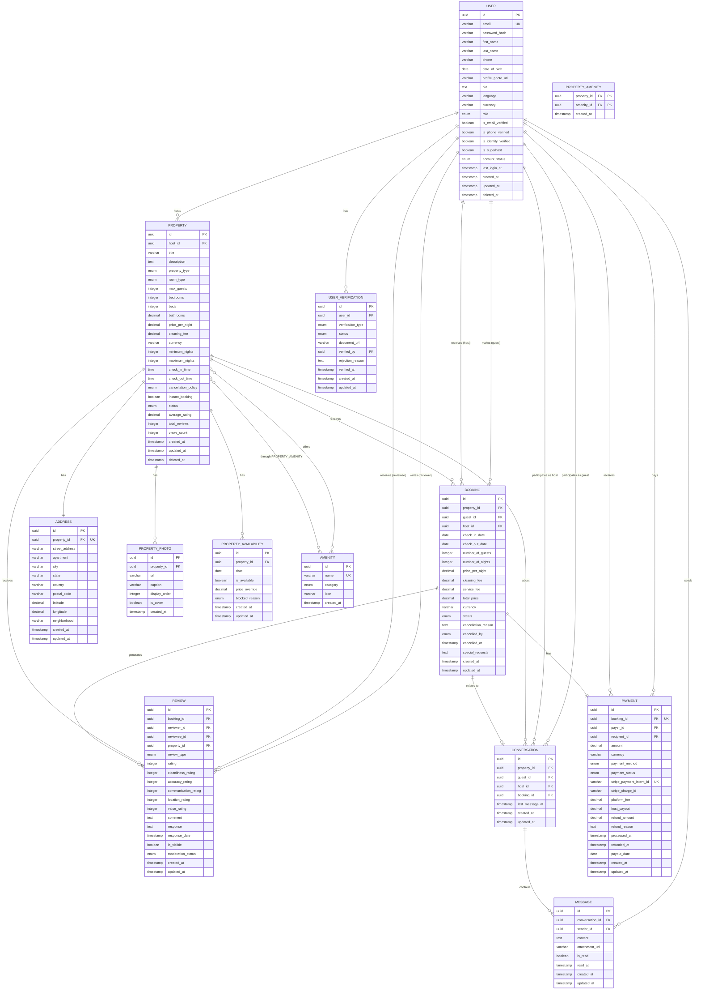

# Modelagem de Dados - Sistema de Aluguel de Acomodações

## Especificação Detalhada das Entidades

---

## 1. USER (Usuários)

### Descrição
Armazena todos os usuários da plataforma (hóspedes, anfitriões, administradores). Um usuário pode ter múltiplos papéis simultaneamente.

### Atributos

| Atributo | Tipo | Obrigatório | Único | Descrição |
|----------|------|-------------|-------|-----------|
| **id** | UUID | ✅ | ✅ | Identificador único |
| **email** | VARCHAR(255) | ✅ | ✅ | Email do usuário |
| **password_hash** | VARCHAR(255) | ✅ | ❌ | Hash bcrypt da senha |
| **first_name** | VARCHAR(100) | ✅ | ❌ | Primeiro nome |
| **last_name** | VARCHAR(100) | ✅ | ❌ | Sobrenome |
| **phone** | VARCHAR(20) | ❌ | ❌ | Telefone com código do país |
| **date_of_birth** | DATE | ❌ | ❌ | Data de nascimento |
| **profile_photo_url** | VARCHAR(500) | ❌ | ❌ | URL da foto de perfil |
| **bio** | TEXT | ❌ | ❌ | Biografia do usuário |
| **language** | VARCHAR(10) | ✅ | ❌ | Idioma preferido (ISO 639-1) |
| **currency** | VARCHAR(3) | ✅ | ❌ | Moeda preferida (ISO 4217) |
| **role** | ENUM | ✅ | ❌ | guest, host, admin, moderator, support |
| **is_email_verified** | BOOLEAN | ✅ | ❌ | Email verificado (default: false) |
| **is_phone_verified** | BOOLEAN | ✅ | ❌ | Telefone verificado (default: false) |
| **is_identity_verified** | BOOLEAN | ✅ | ❌ | Identidade verificada (default: false) |
| **is_superhost** | BOOLEAN | ✅ | ❌ | Status de Superhost (default: false) |
| **account_status** | ENUM | ✅ | ❌ | active, suspended, banned, deleted |
| **last_login_at** | TIMESTAMP | ❌ | ❌ | Último login |
| **created_at** | TIMESTAMP | ✅ | ❌ | Data de criação |
| **updated_at** | TIMESTAMP | ✅ | ❌ | Data de atualização |
| **deleted_at** | TIMESTAMP | ❌ | ❌ | Soft delete |

### Chave Primária
- `id` (UUID)

### Relacionamentos
- **1:N** com `Property` (um usuário pode ter várias propriedades)
- **1:N** com `Booking` (um usuário pode fazer várias reservas)
- **1:N** com `Review` (um usuário pode escrever várias avaliações)
- **1:N** com `Message` (um usuário pode enviar várias mensagens)
- **1:N** com `Payment` (um usuário pode ter vários pagamentos)
- **1:N** com `UserVerification` (um usuário pode ter várias verificações)

### Constraints e Regras
```sql
CHECK (email ~* '^[A-Za-z0-9._%+-]+@[A-Za-z0-9.-]+\.[A-Z|a-z]{2,}$')
CHECK (role IN ('guest', 'host', 'admin', 'moderator', 'support'))
CHECK (account_status IN ('active', 'suspended', 'banned', 'deleted'))
CHECK (date_of_birth IS NULL OR date_of_birth < CURRENT_DATE - INTERVAL '18 years')
```

### Índices Sugeridos
```sql
CREATE UNIQUE INDEX idx_user_email ON user(email) WHERE deleted_at IS NULL;
CREATE INDEX idx_user_role ON user(role);
CREATE INDEX idx_user_account_status ON user(account_status);
CREATE INDEX idx_user_created_at ON user(created_at DESC);
CREATE INDEX idx_user_is_superhost ON user(is_superhost) WHERE is_superhost = true;
```

---

## 2. PROPERTY (Propriedades/Acomodações)

### Descrição
Representa as acomodações disponíveis para aluguel na plataforma.

### Atributos

| Atributo | Tipo | Obrigatório | Único | Descrição |
|----------|------|-------------|-------|-----------|
| **id** | UUID | ✅ | ✅ | Identificador único |
| **host_id** | UUID | ✅ | ❌ | FK para User (anfitrião) |
| **title** | VARCHAR(255) | ✅ | ❌ | Título do anúncio |
| **description** | TEXT | ✅ | ❌ | Descrição completa |
| **property_type** | ENUM | ✅ | ❌ | apartment, house, villa, room, studio |
| **room_type** | ENUM | ✅ | ❌ | entire_place, private_room, shared_room |
| **max_guests** | INTEGER | ✅ | ❌ | Número máximo de hóspedes |
| **bedrooms** | INTEGER | ✅ | ❌ | Número de quartos |
| **beds** | INTEGER | ✅ | ❌ | Número de camas |
| **bathrooms** | DECIMAL(3,1) | ✅ | ❌ | Número de banheiros (permite 1.5) |
| **price_per_night** | DECIMAL(10,2) | ✅ | ❌ | Preço por noite (moeda base: USD) |
| **cleaning_fee** | DECIMAL(10,2) | ❌ | ❌ | Taxa de limpeza |
| **currency** | VARCHAR(3) | ✅ | ❌ | Moeda do preço (ISO 4217) |
| **minimum_nights** | INTEGER | ✅ | ❌ | Estadia mínima (default: 1) |
| **maximum_nights** | INTEGER | ✅ | ❌ | Estadia máxima (default: 365) |
| **check_in_time** | TIME | ✅ | ❌ | Horário de check-in |
| **check_out_time** | TIME | ✅ | ❌ | Horário de check-out |
| **cancellation_policy** | ENUM | ✅ | ❌ | flexible, moderate, strict |
| **instant_booking** | BOOLEAN | ✅ | ❌ | Reserva instantânea (default: false) |
| **status** | ENUM | ✅ | ❌ | draft, pending_approval, active, paused, rejected |
| **average_rating** | DECIMAL(3,2) | ❌ | ❌ | Avaliação média (calculado) |
| **total_reviews** | INTEGER | ✅ | ❌ | Total de avaliações (default: 0) |
| **views_count** | INTEGER | ✅ | ❌ | Contador de visualizações |
| **created_at** | TIMESTAMP | ✅ | ❌ | Data de criação |
| **updated_at** | TIMESTAMP | ✅ | ❌ | Data de atualização |
| **deleted_at** | TIMESTAMP | ❌ | ❌ | Soft delete |

### Chave Primária
- `id` (UUID)

### Chaves Estrangeiras
- `host_id` → `user.id`

### Relacionamentos
- **N:1** com `User` (muitas propriedades para um anfitrião)
- **1:1** com `Address` (uma propriedade tem um endereço)
- **1:N** com `PropertyPhoto` (uma propriedade tem várias fotos)
- **1:N** com `Booking` (uma propriedade pode ter várias reservas)
- **1:N** com `Review` (uma propriedade pode ter várias avaliações)
- **N:N** com `Amenity` através de `PropertyAmenity`
- **1:N** com `PropertyAvailability` (calendário de disponibilidade)

### Constraints e Regras
```sql
CHECK (max_guests > 0 AND max_guests <= 16)
CHECK (bedrooms >= 0)
CHECK (beds > 0)
CHECK (bathrooms > 0)
CHECK (price_per_night > 0)
CHECK (cleaning_fee >= 0)
CHECK (minimum_nights > 0 AND minimum_nights <= maximum_nights)
CHECK (maximum_nights <= 365)
CHECK (average_rating IS NULL OR (average_rating >= 0 AND average_rating <= 5))
CHECK (status IN ('draft', 'pending_approval', 'active', 'paused', 'rejected'))
CHECK (cancellation_policy IN ('flexible', 'moderate', 'strict'))
```

### Índices Sugeridos
```sql
CREATE INDEX idx_property_host_id ON property(host_id);
CREATE INDEX idx_property_status ON property(status);
CREATE INDEX idx_property_price ON property(price_per_night);
CREATE INDEX idx_property_rating ON property(average_rating DESC);
CREATE INDEX idx_property_created_at ON property(created_at DESC);
CREATE INDEX idx_property_type ON property(property_type, room_type);
CREATE INDEX idx_property_instant_booking ON property(instant_booking) WHERE instant_booking = true;
```

---

## 3. ADDRESS (Endereços)

### Descrição
Armazena informações de localização das propriedades.

### Atributos

| Atributo | Tipo | Obrigatório | Único | Descrição |
|----------|------|-------------|-------|-----------|
| **id** | UUID | ✅ | ✅ | Identificador único |
| **property_id** | UUID | ✅ | ✅ | FK para Property |
| **street_address** | VARCHAR(255) | ✅ | ❌ | Endereço completo |
| **apartment** | VARCHAR(50) | ❌ | ❌ | Apartamento/complemento |
| **city** | VARCHAR(100) | ✅ | ❌ | Cidade |
| **state** | VARCHAR(100) | ✅ | ❌ | Estado/província |
| **country** | VARCHAR(100) | ✅ | ❌ | País |
| **postal_code** | VARCHAR(20) | ✅ | ❌ | CEP/código postal |
| **latitude** | DECIMAL(10,8) | ✅ | ❌ | Latitude (para mapas) |
| **longitude** | DECIMAL(11,8) | ✅ | ❌ | Longitude (para mapas) |
| **neighborhood** | VARCHAR(100) | ❌ | ❌ | Bairro |
| **created_at** | TIMESTAMP | ✅ | ❌ | Data de criação |
| **updated_at** | TIMESTAMP | ✅ | ❌ | Data de atualização |

### Chave Primária
- `id` (UUID)

### Chaves Estrangeiras
- `property_id` → `property.id` (UNIQUE)

### Relacionamentos
- **1:1** com `Property`

### Constraints e Regras
```sql
CHECK (latitude >= -90 AND latitude <= 90)
CHECK (longitude >= -180 AND longitude <= 180)
CHECK (LENGTH(postal_code) >= 3)
```

### Índices Sugeridos
```sql
CREATE UNIQUE INDEX idx_address_property_id ON address(property_id);
CREATE INDEX idx_address_location ON address USING GIST(ll_to_earth(latitude, longitude));
CREATE INDEX idx_address_city_country ON address(city, country);
CREATE INDEX idx_address_postal_code ON address(postal_code);
```

**Nota:** O índice GIST com `ll_to_earth` permite busca por proximidade geográfica (requer extensão `earthdistance`).

---

## 4. AMENITY (Comodidades)

### Descrição
Catálogo de comodidades disponíveis (Wi-Fi, piscina, ar-condicionado, etc).

### Atributos

| Atributo | Tipo | Obrigatório | Único | Descrição |
|----------|------|-------------|-------|-----------|
| **id** | UUID | ✅ | ✅ | Identificador único |
| **name** | VARCHAR(100) | ✅ | ✅ | Nome da comodidade |
| **category** | ENUM | ✅ | ❌ | basic, safety, accessibility, kitchen, bathroom, outdoor |
| **icon** | VARCHAR(50) | ❌ | ❌ | Nome do ícone (Material/FontAwesome) |
| **created_at** | TIMESTAMP | ✅ | ❌ | Data de criação |

### Chave Primária
- `id` (UUID)

### Relacionamentos
- **N:N** com `Property` através de `PropertyAmenity`

### Constraints e Regras
```sql
CHECK (category IN ('basic', 'safety', 'accessibility', 'kitchen', 'bathroom', 'outdoor'))
```

### Índices Sugeridos
```sql
CREATE UNIQUE INDEX idx_amenity_name ON amenity(LOWER(name));
CREATE INDEX idx_amenity_category ON amenity(category);
```

---

## 5. PROPERTY_AMENITY (Tabela Associativa)

### Descrição
Relaciona propriedades com suas comodidades (N:N).

### Atributos

| Atributo | Tipo | Obrigatório | Único | Descrição |
|----------|------|-------------|-------|-----------|
| **property_id** | UUID | ✅ | ❌ | FK para Property |
| **amenity_id** | UUID | ✅ | ❌ | FK para Amenity |
| **created_at** | TIMESTAMP | ✅ | ❌ | Data de criação |

### Chave Primária Composta
- `(property_id, amenity_id)`

### Chaves Estrangeiras
- `property_id` → `property.id` (ON DELETE CASCADE)
- `amenity_id` → `amenity.id` (ON DELETE RESTRICT)

### Índices Sugeridos
```sql
CREATE INDEX idx_property_amenity_property ON property_amenity(property_id);
CREATE INDEX idx_property_amenity_amenity ON property_amenity(amenity_id);
```

---

## 6. PROPERTY_PHOTO (Fotos da Propriedade)

### Descrição
Armazena fotos das propriedades.

### Atributos

| Atributo | Tipo | Obrigatório | Único | Descrição |
|----------|------|-------------|-------|-----------|
| **id** | UUID | ✅ | ✅ | Identificador único |
| **property_id** | UUID | ✅ | ❌ | FK para Property |
| **url** | VARCHAR(500) | ✅ | ❌ | URL da imagem (S3/CDN) |
| **caption** | VARCHAR(255) | ❌ | ❌ | Legenda da foto |
| **display_order** | INTEGER | ✅ | ❌ | Ordem de exibição |
| **is_cover** | BOOLEAN | ✅ | ❌ | Foto de capa (default: false) |
| **created_at** | TIMESTAMP | ✅ | ❌ | Data de upload |

### Chave Primária
- `id` (UUID)

### Chaves Estrangeiras
- `property_id` → `property.id` (ON DELETE CASCADE)

### Relacionamentos
- **N:1** com `Property`

### Constraints e Regras
```sql
CHECK (display_order > 0)
-- Apenas uma foto de capa por propriedade (implementado via trigger ou application logic)
```

### Índices Sugeridos
```sql
CREATE INDEX idx_property_photo_property_id ON property_photo(property_id);
CREATE INDEX idx_property_photo_order ON property_photo(property_id, display_order);
CREATE INDEX idx_property_photo_cover ON property_photo(property_id) WHERE is_cover = true;
```

---

## 7. BOOKING (Reservas)

### Descrição
Representa as reservas feitas por hóspedes.

### Atributos

| Atributo | Tipo | Obrigatório | Único | Descrição |
|----------|------|-------------|-------|-----------|
| **id** | UUID | ✅ | ✅ | Identificador único |
| **property_id** | UUID | ✅ | ❌ | FK para Property |
| **guest_id** | UUID | ✅ | ❌ | FK para User (hóspede) |
| **host_id** | UUID | ✅ | ❌ | FK para User (anfitrião) - denormalizado |
| **check_in_date** | DATE | ✅ | ❌ | Data de check-in |
| **check_out_date** | DATE | ✅ | ❌ | Data de check-out |
| **number_of_guests** | INTEGER | ✅ | ❌ | Número de hóspedes |
| **number_of_nights** | INTEGER | ✅ | ❌ | Número de noites (calculado) |
| **price_per_night** | DECIMAL(10,2) | ✅ | ❌ | Preço por noite (snapshot) |
| **cleaning_fee** | DECIMAL(10,2) | ✅ | ❌ | Taxa de limpeza (snapshot) |
| **service_fee** | DECIMAL(10,2) | ✅ | ❌ | Taxa de serviço da plataforma |
| **total_price** | DECIMAL(10,2) | ✅ | ❌ | Preço total |
| **currency** | VARCHAR(3) | ✅ | ❌ | Moeda (ISO 4217) |
| **status** | ENUM | ✅ | ❌ | pending, confirmed, cancelled, completed, disputed |
| **cancellation_reason** | TEXT | ❌ | ❌ | Motivo do cancelamento |
| **cancelled_by** | ENUM | ❌ | ❌ | guest, host, admin |
| **cancelled_at** | TIMESTAMP | ❌ | ❌ | Data do cancelamento |
| **special_requests** | TEXT | ❌ | ❌ | Pedidos especiais do hóspede |
| **created_at** | TIMESTAMP | ✅ | ❌ | Data da reserva |
| **updated_at** | TIMESTAMP | ✅ | ❌ | Data de atualização |

### Chave Primária
- `id` (UUID)

### Chaves Estrangeiras
- `property_id` → `property.id`
- `guest_id` → `user.id`
- `host_id` → `user.id`

### Relacionamentos
- **N:1** com `Property`
- **N:1** com `User` (guest)
- **N:1** com `User` (host)
- **1:1** com `Payment`
- **1:N** com `Review` (hóspede avalia propriedade, anfitrião avalia hóspede)

### Constraints e Regras
```sql
CHECK (check_out_date > check_in_date)
CHECK (number_of_guests > 0)
CHECK (number_of_nights > 0)
CHECK (total_price > 0)
CHECK (status IN ('pending', 'confirmed', 'cancelled', 'completed', 'disputed'))
CHECK (cancelled_by IS NULL OR cancelled_by IN ('guest', 'host', 'admin'))
-- Evitar reservas sobrepostas (implementado via trigger ou EXCLUDE constraint)
```

### Índices Sugeridos
```sql
CREATE INDEX idx_booking_property_id ON booking(property_id);
CREATE INDEX idx_booking_guest_id ON booking(guest_id);
CREATE INDEX idx_booking_host_id ON booking(host_id);
CREATE INDEX idx_booking_status ON booking(status);
CREATE INDEX idx_booking_dates ON booking(check_in_date, check_out_date);
CREATE INDEX idx_booking_created_at ON booking(created_at DESC);

-- Evitar sobreposição de reservas confirmadas
CREATE EXTENSION IF NOT EXISTS btree_gist;
CREATE UNIQUE INDEX idx_booking_no_overlap ON booking 
USING GIST (property_id, daterange(check_in_date, check_out_date, '[]'))
WHERE status IN ('confirmed', 'pending');
```

---

## 8. PAYMENT (Pagamentos)

### Descrição
Registra transações de pagamento associadas a reservas.

### Atributos

| Atributo | Tipo | Obrigatório | Único | Descrição |
|----------|------|-------------|-------|-----------|
| **id** | UUID | ✅ | ✅ | Identificador único |
| **booking_id** | UUID | ✅ | ✅ | FK para Booking |
| **payer_id** | UUID | ✅ | ❌ | FK para User (quem paga) |
| **recipient_id** | UUID | ✅ | ❌ | FK para User (quem recebe) |
| **amount** | DECIMAL(10,2) | ✅ | ❌ | Valor da transação |
| **currency** | VARCHAR(3) | ✅ | ❌ | Moeda (ISO 4217) |
| **payment_method** | ENUM | ✅ | ❌ | credit_card, debit_card, paypal, pix, bank_transfer |
| **payment_status** | ENUM | ✅ | ❌ | pending, processing, succeeded, failed, refunded |
| **stripe_payment_intent_id** | VARCHAR(255) | ❌ | ✅ | ID da transação no Stripe |
| **stripe_charge_id** | VARCHAR(255) | ❌ | ❌ | ID da cobrança no Stripe |
| **platform_fee** | DECIMAL(10,2) | ✅ | ❌ | Taxa retida pela plataforma |
| **host_payout** | DECIMAL(10,2) | ✅ | ❌ | Valor a ser pago ao anfitrião |
| **refund_amount** | DECIMAL(10,2) | ❌ | ❌ | Valor reembolsado (se aplicável) |
| **refund_reason** | TEXT | ❌ | ❌ | Motivo do reembolso |
| **processed_at** | TIMESTAMP | ❌ | ❌ | Data de processamento |
| **refunded_at** | TIMESTAMP | ❌ | ❌ | Data do reembolso |
| **payout_date** | DATE | ❌ | ❌ | Data de pagamento ao anfitrião |
| **created_at** | TIMESTAMP | ✅ | ❌ | Data de criação |
| **updated_at** | TIMESTAMP | ✅ | ❌ | Data de atualização |

### Chave Primária
- `id` (UUID)

### Chaves Estrangeiras
- `booking_id` → `booking.id` (UNIQUE)
- `payer_id` → `user.id`
- `recipient_id` → `user.id`

### Relacionamentos
- **1:1** com `Booking`
- **N:1** com `User` (payer)
- **N:1** com `User` (recipient)

### Constraints e Regras
```sql
CHECK (amount > 0)
CHECK (platform_fee >= 0)
CHECK (host_payout >= 0)
CHECK (refund_amount IS NULL OR refund_amount <= amount)
CHECK (payment_status IN ('pending', 'processing', 'succeeded', 'failed', 'refunded'))
CHECK (payment_method IN ('credit_card', 'debit_card', 'paypal', 'pix', 'bank_transfer'))
CHECK (amount = platform_fee + host_payout)
```

### Índices Sugeridos
```sql
CREATE UNIQUE INDEX idx_payment_booking_id ON payment(booking_id);
CREATE INDEX idx_payment_payer_id ON payment(payer_id);
CREATE INDEX idx_payment_recipient_id ON payment(recipient_id);
CREATE INDEX idx_payment_status ON payment(payment_status);
CREATE UNIQUE INDEX idx_payment_stripe_intent ON payment(stripe_payment_intent_id) WHERE stripe_payment_intent_id IS NOT NULL;
CREATE INDEX idx_payment_created_at ON payment(created_at DESC);
```

---

## 9. REVIEW (Avaliações)

### Descrição
Avaliações bidirecionais: hóspede avalia propriedade/anfitrião, anfitrião avalia hóspede.

### Atributos

| Atributo | Tipo | Obrigatório | Único | Descrição |
|----------|------|-------------|-------|-----------|
| **id** | UUID | ✅ | ✅ | Identificador único |
| **booking_id** | UUID | ✅ | ❌ | FK para Booking |
| **reviewer_id** | UUID | ✅ | ❌ | FK para User (quem avalia) |
| **reviewee_id** | UUID | ✅ | ❌ | FK para User (quem é avaliado) |
| **property_id** | UUID | ❌ | ❌ | FK para Property (se for avaliação de propriedade) |
| **review_type** | ENUM | ✅ | ❌ | property_review, guest_review |
| **rating** | INTEGER | ✅ | ❌ | Nota geral (1-5) |
| **cleanliness_rating** | INTEGER | ❌ | ❌ | Limpeza (1-5) - apenas property |
| **accuracy_rating** | INTEGER | ❌ | ❌ | Precisão (1-5) - apenas property |
| **communication_rating** | INTEGER | ❌ | ❌ | Comunicação (1-5) |
| **location_rating** | INTEGER | ❌ | ❌ | Localização (1-5) - apenas property |
| **value_rating** | INTEGER | ❌ | ❌ | Custo-benefício (1-5) - apenas property |
| **comment** | TEXT | ✅ | ❌ | Comentário escrito |
| **response** | TEXT | ❌ | ❌ | Resposta do anfitrião |
| **response_date** | TIMESTAMP | ❌ | ❌ | Data da resposta |
| **is_visible** | BOOLEAN | ✅ | ❌ | Visível publicamente (default: true) |
| **moderation_status** | ENUM | ✅ | ❌ | pending, approved, rejected |
| **created_at** | TIMESTAMP | ✅ | ❌ | Data da avaliação |
| **updated_at** | TIMESTAMP | ✅ | ❌ | Data de atualização |

### Chave Primária
- `id` (UUID)

### Chaves Estrangeiras
- `booking_id` → `booking.id`
- `reviewer_id` → `user.id`
- `reviewee_id` → `user.id`
- `property_id` → `property.id` (nullable)

### Relacionamentos
- **N:1** com `Booking`
- **N:1** com `User` (reviewer)
- **N:1** com `User` (reviewee)
- **N:1** com `Property` (opcional)

### Constraints e Regras
```sql
CHECK (rating >= 1 AND rating <= 5)
CHECK (cleanliness_rating IS NULL OR (cleanliness_rating >= 1 AND cleanliness_rating <= 5))
CHECK (accuracy_rating IS NULL OR (accuracy_rating >= 1 AND accuracy_rating <= 5))
CHECK (communication_rating IS NULL OR (communication_rating >= 1 AND communication_rating <= 5))
CHECK (location_rating IS NULL OR (location_rating >= 1 AND location_rating <= 5))
CHECK (value_rating IS NULL OR (value_rating >= 1 AND value_rating <= 5))
CHECK (review_type IN ('property_review', 'guest_review'))
CHECK (moderation_status IN ('pending', 'approved', 'rejected'))
CHECK (LENGTH(comment) >= 10)
-- Se property_review, property_id deve ser NOT NULL
CHECK ((review_type = 'property_review' AND property_id IS NOT NULL) OR 
       (review_type = 'guest_review' AND property_id IS NULL))
-- Apenas uma avaliação por tipo por reserva
```

### Índices Sugeridos
```sql
CREATE INDEX idx_review_booking_id ON review(booking_id);
CREATE INDEX idx_review_reviewer_id ON review(reviewer_id);
CREATE INDEX idx_review_reviewee_id ON review(reviewee_id);
CREATE INDEX idx_review_property_id ON review(property_id) WHERE property_id IS NOT NULL;
CREATE INDEX idx_review_type ON review(review_type);
CREATE INDEX idx_review_rating ON review(rating);
CREATE INDEX idx_review_visible ON review(is_visible) WHERE is_visible = true;
CREATE INDEX idx_review_created_at ON review(created_at DESC);

-- Garantir apenas uma avaliação de cada tipo por reserva
CREATE UNIQUE INDEX idx_review_unique_property ON review(booking_id, review_type)
WHERE review_type = 'property_review';
CREATE UNIQUE INDEX idx_review_unique_guest ON review(booking_id, review_type)
WHERE review_type = 'guest_review';
```

---

## 10. MESSAGE (Mensagens)

### Descrição
Sistema de mensagens entre hóspedes e anfitriões.

### Atributos

| Atributo | Tipo | Obrigatório | Único | Descrição |
|----------|------|-------------|-------|-----------|
| **id** | UUID | ✅ | ✅ | Identificador único |
| **conversation_id** | UUID | ✅ | ❌ | FK para Conversation |
| **sender_id** | UUID | ✅ | ❌ | FK para User (remetente) |
| **content** | TEXT | ✅ | ❌ | Conteúdo da mensagem |
| **attachment_url** | VARCHAR(500) | ❌ | ❌ | URL de anexo (imagem) |
| **is_read** | BOOLEAN | ✅ | ❌ | Mensagem lida (default: false) |
| **read_at** | TIMESTAMP | ❌ | ❌ | Data de leitura |
| **created_at** | TIMESTAMP | ✅ | ❌ | Data de envio |
| **updated_at** | TIMESTAMP | ✅ | ❌ | Data de atualização |

### Chave Primária
- `id` (UUID)

### Chaves Estrangeiras
- `conversation_id` → `conversation.id` (ON DELETE CASCADE)
- `sender_id` → `user.id`

### Relacionamentos
- **N:1** com `Conversation`
- **N:1** com `User` (sender)

### Constraints e Regras
```sql
CHECK (LENGTH(content) > 0 OR attachment_url IS NOT NULL)
```

### Índices Sugeridos
```sql
CREATE INDEX idx_message_conversation_id ON message(conversation_id);
CREATE INDEX idx_message_sender_id ON message(sender_id);
CREATE INDEX idx_message_created_at ON message(conversation_id, created_at DESC);
CREATE INDEX idx_message_unread ON message(conversation_id) WHERE is_read = false;
```

---

## 11. CONVERSATION (Conversas)

### Descrição
Agrupa mensagens entre dois usuários em relação a uma propriedade.

### Atributos

| Atributo | Tipo | Obrigatório | Único | Descrição |
|----------|------|-------------|-------|-----------|
| **id** | UUID | ✅ | ✅ | Identificador único |
| **property_id** | UUID | ✅ | ❌ | FK para Property |
| **guest_id** | UUID | ✅ | ❌ | FK para User (hóspede) |
| **host_id** | UUID | ✅ | ❌ | FK para User (anfitrião) |
| **booking_id** | UUID | ❌ | ❌ | FK para Booking (se houver) |
| **last_message_at** | TIMESTAMP | ❌ | ❌ | Data da última mensagem |
| **created_at** | TIMESTAMP | ✅ | ❌ | Data de criação |
| **updated_at** | TIMESTAMP | ✅ | ❌ | Data de atualização |

### Chave Primária
- `id` (UUID)

### Chaves Estrangeiras
- `property_id` → `property.id`
- `guest_id` → `user.id`
- `host_id` → `user.id`
- `booking_id` → `booking.id` (nullable)

### Relacionamentos
- **1:N** com `Message`
- **N:1** com `Property`
- **N:1** com `User` (guest)
- **N:1** com `User` (host)
- **N:1** com `Booking` (opcional)

### Constraints e Regras
```sql
CHECK (guest_id != host_id)
-- Apenas uma conversa por combinação de guest + host + property
```

### Índices Sugeridos
```sql
CREATE INDEX idx_conversation_property_id ON conversation(property_id);
CREATE INDEX idx_conversation_guest_id ON conversation(guest_id);
CREATE INDEX idx_conversation_host_id ON conversation(host_id);
CREATE INDEX idx_conversation_booking_id ON conversation(booking_id) WHERE booking_id IS NOT NULL;
CREATE INDEX idx_conversation_last_message ON conversation(last_message_at DESC);

-- Garantir apenas uma conversa por combinação
CREATE UNIQUE INDEX idx_conversation_unique ON conversation(property_id, guest_id, host_id);
```

---

## 12. PROPERTY_AVAILABILITY (Disponibilidade)

### Descrição
Calendário de disponibilidade e bloqueios de datas por propriedade.

### Atributos

| Atributo | Tipo | Obrigatório | Único | Descrição |
|----------|------|-------------|-------|-----------|
| **id** | UUID | ✅ | ✅ | Identificador único |
| **property_id** | UUID | ✅ | ❌ | FK para Property |
| **date** | DATE | ✅ | ❌ | Data específica |
| **is_available** | BOOLEAN | ✅ | ❌ | Disponível para reserva |
| **price_override** | DECIMAL(10,2) | ❌ | ❌ | Preço customizado para esta data |
| **blocked_reason** | ENUM | ❌ | ❌ | booked, owner_blocked, maintenance |
| **created_at** | TIMESTAMP | ✅ | ❌ | Data de criação |
| **updated_at** | TIMESTAMP | ✅ | ❌ | Data de atualização |

### Chave Primária
- `id` (UUID)

### Chaves Estrangeiras
- `property_id` → `property.id` (ON DELETE CASCADE)

### Relacionamentos
- **N:1** com `Property`

### Constraints e Regras
```sql
CHECK (blocked_reason IS NULL OR blocked_reason IN ('booked', 'owner_blocked', 'maintenance'))
CHECK (price_override IS NULL OR price_override > 0)
```

### Índices Sugeridos
```sql
CREATE UNIQUE INDEX idx_availability_property_date ON property_availability(property_id, date);
CREATE INDEX idx_availability_date_range ON property_availability(property_id, date) 
WHERE is_available = true;
```

---

## 13. USER_VERIFICATION (Verificações de Usuário)

### Descrição
Registra verificações de identidade, email, telefone, etc.

### Atributos

| Atributo | Tipo | Obrigatório | Único | Descrição |
|----------|------|-------------|-------|-----------|
| **id** | UUID | ✅ | ✅ | Identificador único |
| **user_id** | UUID | ✅ | ❌ | FK para User |
| **verification_type** | ENUM | ✅ | ❌ | email, phone, identity_document, selfie |
| **status** | ENUM | ✅ | ❌ | pending, approved, rejected |
| **document_url** | VARCHAR(500) | ❌ | ❌ | URL do documento (se aplicável) |
| **verified_by** | UUID | ❌ | ❌ | FK para User (admin/moderador) |
| **rejection_reason** | TEXT | ❌ | ❌ | Motivo da rejeição |
| **verified_at** | TIMESTAMP | ❌ | ❌ | Data da verificação |
| **created_at** | TIMESTAMP | ✅ | ❌ | Data de submissão |
| **updated_at** | TIMESTAMP | ✅ | ❌ | Data de atualização |

### Chave Primária
- `id` (UUID)

### Chaves Estrangeiras
- `user_id` → `user.id`
- `verified_by` → `user.id` (nullable)

### Constraints e Regras
```sql
CHECK (verification_type IN ('email', 'phone', 'identity_document', 'selfie'))
CHECK (status IN ('pending', 'approved', 'rejected'))
```

### Índices Sugeridos
```sql
CREATE INDEX idx_verification_user_id ON user_verification(user_id);
CREATE INDEX idx_verification_status ON user_verification(status);
CREATE INDEX idx_verification_type ON user_verification(verification_type);
```

---

## Diagrama Entidade-Relacionamento (ER) em Mermaid



---

## Resumo de Decisões de Design

### 1. **Uso de UUID como Chave Primária**
- ✅ **Vantagens:** Globalmente único, dificulta enumeração, facilita merge de dados
- ✅ **Ideal para:** Sistemas distribuídos, APIs públicas
- ⚠️ **Consideração:** Ligeiramente maior (16 bytes vs 4/8 bytes INTEGER)

### 2. **Soft Delete (`deleted_at`)**
- ✅ Aplicado em: `User`, `Property`
- ✅ Permite recuperação de dados
- ✅ Mantém integridade referencial
- ⚠️ Requer filtro `WHERE deleted_at IS NULL` em queries

### 3. **Campos de Auditoria**
- `created_at`: TIMESTAMP NOT NULL DEFAULT CURRENT_TIMESTAMP
- `updated_at`: TIMESTAMP NOT NULL DEFAULT CURRENT_TIMESTAMP ON UPDATE CURRENT_TIMESTAMP
- `deleted_at`: TIMESTAMP NULL (soft delete)

### 4. **Denormalização Estratégica**
- `booking.host_id`: Evita JOIN com Property para pegar o host
- `property.average_rating`: Cache calculado (atualizado via trigger)
- `property.total_reviews`: Contador mantido por trigger

### 5. **Constraints de Integridade**
- CHECK constraints para validação de dados (ratings 1-5, preços > 0)
- UNIQUE constraints compostos (property_id + date em availability)
- EXCLUDE constraints para evitar overlapping de reservas

### 6. **Índices de Performance**

**Para Buscas:**
- Índice GIST em latitude/longitude para busca geográfica
- Índice GIN em Elasticsearch para full-text search
- Índices compostos para queries comuns (property_id + date)

**Para Filtros:**
- Índices em campos frequentemente filtrados (status, rating, price)
- Índices parciais (`WHERE deleted_at IS NULL`)

**Para Ordenação:**
- Índices em `created_at DESC` para listagens recentes
- Índice em `average_rating DESC` para ranking

### 7. **Separação de Concerns**
- `Address` separado de `Property`: Facilita queries geográficas
- `PropertyAmenity`: Tabela associativa para relacionamento N:N
- `Conversation` agrupa `Message`: Facilita queries de histórico

### 8. **Estratégia de Escalabilidade**

**Particionamento Sugerido:**
```sql
-- Particionar Booking por ano (range partitioning)
CREATE TABLE booking_2024 PARTITION OF booking
FOR VALUES FROM ('2024-01-01') TO ('2025-01-01');

-- Particionar Message por hash de conversation_id
CREATE TABLE message_0 PARTITION OF message
FOR VALUES WITH (MODULUS 4, REMAINDER 0);
```

**Read Replicas:**
- Queries de leitura (search, listagens) → Réplica
- Escritas (booking, payment) → Master

### 9. **Triggers Importantes**

```sql
-- Trigger para atualizar average_rating em Property
CREATE TRIGGER update_property_rating
AFTER INSERT OR UPDATE OR DELETE ON review
FOR EACH ROW EXECUTE FUNCTION update_property_rating_fn();

-- Trigger para evitar reservas sobrepostas
CREATE TRIGGER check_booking_overlap
BEFORE INSERT OR UPDATE ON booking
FOR EACH ROW EXECUTE FUNCTION check_booking_overlap_fn();

-- Trigger para atualizar last_message_at em Conversation
CREATE TRIGGER update_conversation_last_message
AFTER INSERT ON message
FOR EACH ROW EXECUTE FUNCTION update_conversation_last_message_fn();
```

### 10. **Segurança e Compliance**

**LGPD/GDPR:**
- `user.deleted_at`: Soft delete para manter histórico de transações
- Possibilidade de anonimizar dados (`email` → `deleted_user_XXX@example.com`)
- Logs de acesso a dados sensíveis

**Criptografia:**
- `password_hash`: Bcrypt com cost factor 12
- Dados de cartão: NUNCA armazenados (apenas token do Stripe)
- `document_url` em `user_verification`: Criptografado em S3

---

## Views Materializadas Sugeridas

```sql
-- View para propriedades com melhor avaliação
CREATE MATERIALIZED VIEW top_rated_properties AS
SELECT p.id, p.title, p.average_rating, p.total_reviews, a.city, a.country
FROM property p
JOIN address a ON a.property_id = p.id
WHERE p.status = 'active' AND p.average_rating >= 4.5 AND p.total_reviews >= 10
ORDER BY p.average_rating DESC, p.total_reviews DESC;

-- Refresh diário via cron job
REFRESH MATERIALIZED VIEW CONCURRENTLY top_rated_properties;

-- View para estatísticas de anfitrião
CREATE MATERIALIZED VIEW host_statistics AS
SELECT 
    u.id,
    COUNT(DISTINCT p.id) as total_properties,
    COUNT(DISTINCT b.id) as total_bookings,
    AVG(r.rating) as average_rating,
    SUM(pay.host_payout) as total_earnings
FROM user u
LEFT JOIN property p ON p.host_id = u.id
LEFT JOIN booking b ON b.host_id = u.id AND b.status = 'completed'
LEFT JOIN review r ON r.reviewee_id = u.id AND r.review_type = 'guest_review'
LEFT JOIN payment pay ON pay.recipient_id = u.id AND pay.payment_status = 'succeeded'
WHERE u.role = 'host'
GROUP BY u.id;
```

---

Este modelo de dados foi projetado para ser **escalável**, **performático** e **manutenível**, seguindo as melhores práticas de normalização (evitando redundância excessiva) enquanto aplica denormalização estratégica onde necessário para performance.